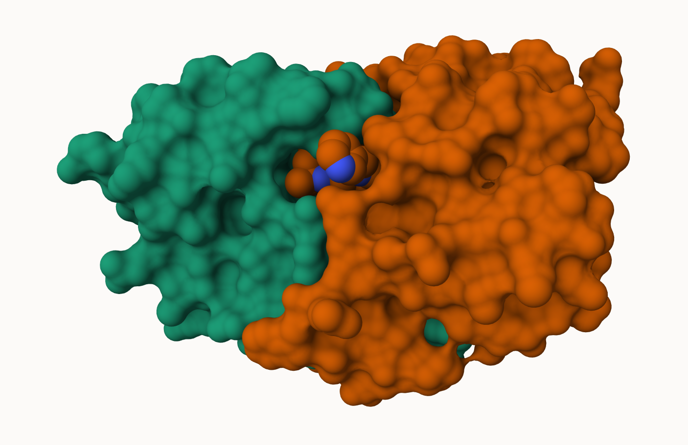
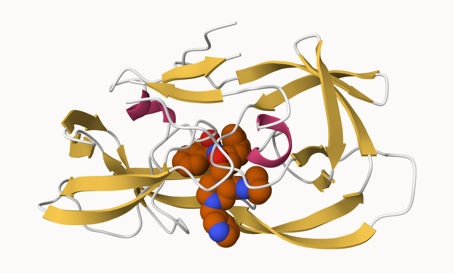
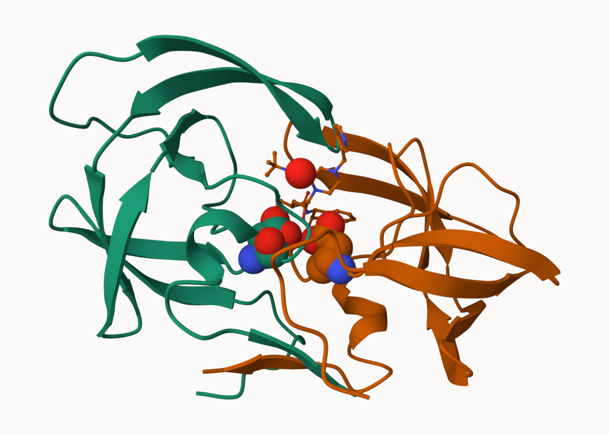
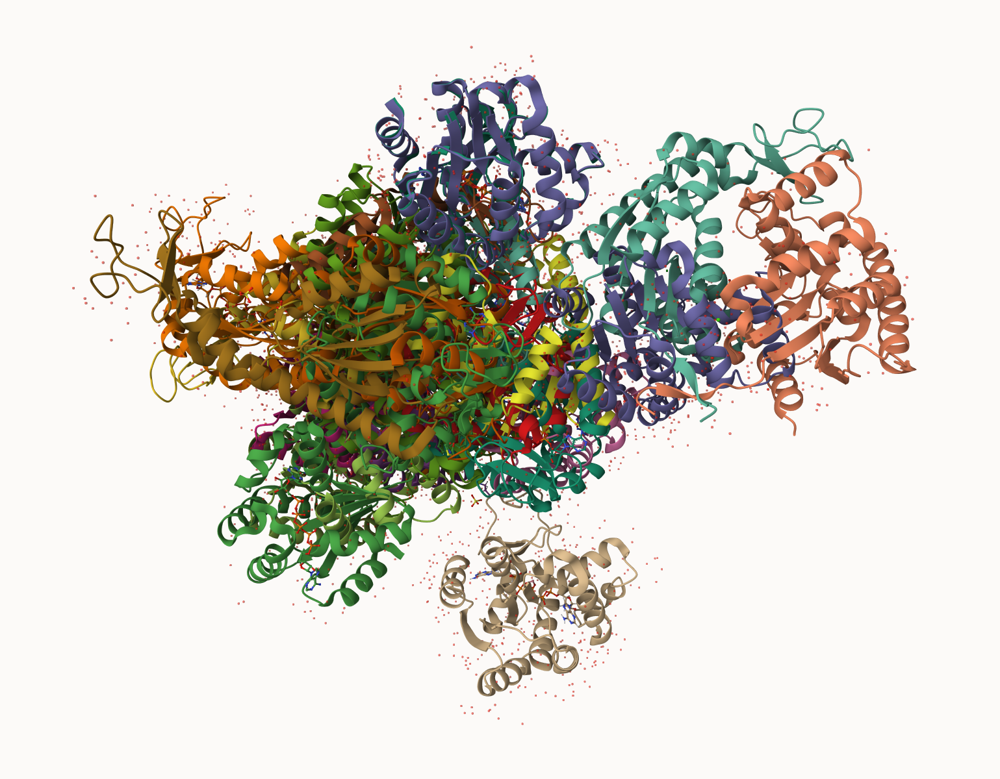

## PDB Stats

The Protein Data Bank (PDB) is the main repository of biomolecular structures. Let's see what it contains:

```{r}
stats <- read.csv("pdb_stats.csv")
stats
```

> Q1: What percentage of structures in the PDB are solved by X-Ray and Electron Microscopy?

About 81% are solved by X-Ray and about 13% are solved by Electron Microscopy.

```{r}
stats$X.ray
```

```{r}
sum(stats$Neutron)
```

The comma in these numbers leads to the numbers here being read as characters.

```{r}
library(readr)
stats <- read_csv("pdb_stats.csv")
stats
```

```{r}
sum(stats$'X-ray')
```
```{r}
n.xray <- sum(stats$'X-ray')
n.total <- sum(stats$Total)
n.xray/n.total
```
```{r}
n.em <- sum(stats$'EM')
n.total <- sum(stats$Total)
n.em/n.total
```

> Q2: What proportion of structures in the PDB are protein?

About 86% of the structures in the PDB are protein (only).

```{r}
stats[1,9]/n.total
```


## Visualizing the HIV-1 protease structure (1HSG)


We can use the Molstar viewer online: https://molstar.org/viewer/.





> Q4: Water molecules normally have 3 atoms. Why do we see just one atom per water molecule in this structure?

The oxygen atom is prominent because of its larger structure and the hydrogens are omitted to present a clearer image.

> Q5: There is a critical “conserved” water molecule in the binding site. Can you identify this water molecule? What residue number does this water molecule have?

332 (HOH)

> Q6: Generate and save a figure clearly showing the two distinct chains of HIV-protease along with the ligand. You might also consider showing the catalytic residues ASP 25 in each chain and the critical water (we recommend “Ball & Stick” for these side-chains). Add this figure to your Quarto document.

A new clean image showing the catalytic ASP25 amino acids in both chains of the HIV-PR dimer along with the inhibitor and the all important active site water.




## Bio3D package for structural bioinformatics

> Q7: How many amino acid residues are there in this pdb object? 

Zero amino acid residues in this PDB object.

> Q8: Name one of the two non-protein residues?

HOH is one of the two non-protein residues.

> Q9: How many protein chains are in this structure?

There are 2 protein chains in this structure.

```{r}
library(bio3d)

pdb <- read.pdb("1hsg")
pdb
```

```{r}
head( pdb$atom )
```

```{r}
library(bio3dview)
library(NGLVieweR)

view.pdb(pdb)
```

```{r}
# Select the important ASP 25 residue
sele <- atom.select(pdb, resno=25)

# and highlight them in spacefill representation
view.pdb(pdb, cols=c("navy","teal"), 
         highlight = sele,
         highlight.style = "spacefill") |>
  setRock()
```


## Predicting functional motions of a single structure

Read an ADK structure from the PDB database:

```{r}
adk <- read.pdb("6s36")
adk
```

```{r}
m <- nma(adk)
plot(m)
```

```{r}
mktrj(m, file="adk_m7.pdb")
```

```{r}
view.nma(m, pdb=adk)
```


## Comparative Structure Analysis of Adenylate Kinase (1AKE)

First step find an ADK sequence:
```{r}
library(bio3d)
id <- "1ake_A" ##Change this to run a different analysis
aa <- get.seq( id )
```

```{r}
aa
```

Next step, is search the PDB database for all related entries:
```{r}
blast <- blast.pdb(aa)
hits <- plot(blast)
```

All the BLAST results are here for us to see:
```{r}
head( blast$hit.tbl )
```

The "top hits" are in the 'hits' object. Now we can download these to our computer. Put these in a wee sub-folder (directory) called "pdbs" and use gzip to speed things up.

```{r}
# Download related PDB files
files <- get.pdb(hits$pdb.id, path="pdbs", split=TRUE, gzip=TRUE)
```



> Q10. Which of the packages above is found only on BioConductor and not CRAN? 

"msa" is only on BioConductor and not CRAN, therefore a "BiocManager" is needed to install "msa."

> Q11. Which of the above packages is not found on BioConductor or CRAN?: 

"bio3dview" is not found on BioConductor or CRAN, therefore "remotes" needs to install it.

> Q12. True or False? Functions from the pak package can be used to install packages from GitHub and BitBucket?

True, functions from "pak" can be used to install packages from GitHub and BitBucket.


Next use 'pdbaln()' function to align and also optionally fit (i.e. superimpose) the identified PDB structures.

This requires a BioConductor package called "msa" that we need to install. First we install BiocManager. Then we use 'BiocManager::install("msa")'

```{r}
# Align releated PDBs
pdbs <- pdbaln(files, fit = TRUE, exefile="msa")
```

Have a wee peek at this new "alignment object" 'pdbs'

```{r}
pdbs
```

We could view these in R with **bio3dview** 'view.pdbs()' function.

```{r}
library(bio3dview)
view.pdbs(pdbs, colorScheme = "residue")
```

## PCA

We can run PCA on our 'pdbs' object using the 'pca()' function from **bio3d**:

```{r}
pc.xray <- pca(pdbs)
plot(pc.xray)
```
```{r}
plot(pc.xray, 1:2)
```

We can make a visualization of the major conformational difference (i.e. large scale structure change) captured by our PCA analysis with the 'mktrj()' function.

```{r}
pc1 <- mktrj(pc.xray, file = "pca.pdb")
```

Let's see in Mol-star

> What is the total number of entries in the PDB?

```{r}
n.total
```

