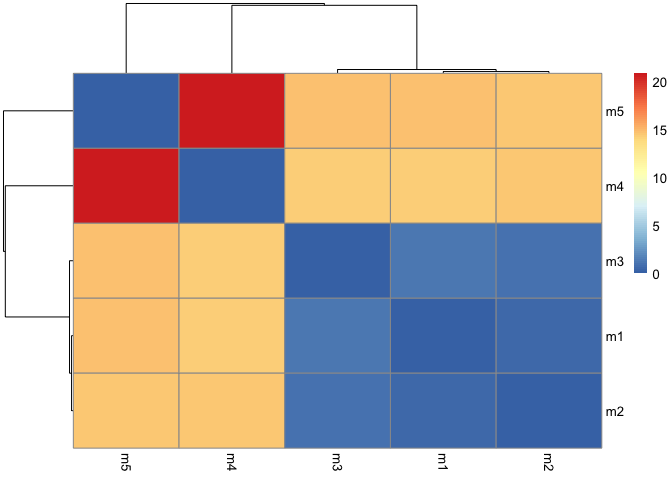

# class11: AlphaFold
Leah Johnson, PID: A17394690

- [Background](#background)
- [Alpha Fold](#alpha-fold)
- [EBI AlphaFold database](#ebi-alphafold-database)
- [Running the AlphaFold](#running-the-alphafold)
- [Interpreting Results](#interpreting-results)
- [Now lets plot the pLDDT values across
  models](#now-lets-plot-the-plddt-values-across-models)
  - [Predicted Alignment Error (PAE) for
    Domains](#predicted-alignment-error-pae-for-domains)
  - [Plot N by N (number of residues)](#plot-n-by-n-number-of-residues)
  - [Residue Conservation from Alignment
    File](#residue-conservation-from-alignment-file)

## Background

We saw last day that the main repository for biomolecular structure (the
PDB database) only has ~250,000 entries.

UniProtKB (the main protein sequence database) has over 200 million
entries!

## Alpha Fold

In this hands-on session we will utilize AlphaFold to predict protein
structure from sequence (Jumper et al. 2021).

Without the aid of such approaches, it can take years of expensive
laboratory work to determine the structure of just one protein. With
AlphaFold we can now accurately compute a typical protein structure in
as little as ten minutes.

## EBI AlphaFold database

The EBI AlphaFold database contains lots of computed structure models.
It is increasing likely that the structure you are interested in is
already in this database at <https://alphafold.ebi.ac.uk/>

There are 3 major outputs from AlphaFold:

1.  A model of structure in **PDB** format.
2.  A **pLDDT score** that tells us how confident the model is for a
    given residue in your protein (high values are good, above 70).
3.  A **PAE score** that tells us about protein packing quality.

If you can’t find a matching entry for the sequence you are interested
in in AFDB, you can run AlphaFold yourself…


## Running the AlphaFold

We will use ColabFold to run AlphaFold on our sequence
<https://colab.research.google.com/github/sokrypton/ColabFold/blob/main/AlphaFold2.ipynb>


## Interpreting Results

Custom Analysis of resulting models

We can read all the AlphaFold results into R and do more quantitative
analysis than just viewing the structures in Mol-star:

Read all the PDB models:

``` r
library(bio3d)
```

``` r
# Change this for YOUR results dir name
results_dir <- "HIVpr_23119/" 

# File names for all PDB models
pdb_files <- list.files(path=results_dir,
                        pattern="*.pdb",
                        full.names = TRUE)
pdbs <- pdbaln(pdb_files, fit=TRUE, exefile="msa")
```

    Reading PDB files:
    HIVpr_23119//HIVpr_23119_unrelaxed_rank_001_alphafold2_multimer_v3_model_4_seed_000.pdb
    HIVpr_23119//HIVpr_23119_unrelaxed_rank_002_alphafold2_multimer_v3_model_1_seed_000.pdb
    HIVpr_23119//HIVpr_23119_unrelaxed_rank_003_alphafold2_multimer_v3_model_5_seed_000.pdb
    HIVpr_23119//HIVpr_23119_unrelaxed_rank_004_alphafold2_multimer_v3_model_2_seed_000.pdb
    HIVpr_23119//HIVpr_23119_unrelaxed_rank_005_alphafold2_multimer_v3_model_3_seed_000.pdb
    .....

    Extracting sequences

    pdb/seq: 1   name: HIVpr_23119//HIVpr_23119_unrelaxed_rank_001_alphafold2_multimer_v3_model_4_seed_000.pdb 
    pdb/seq: 2   name: HIVpr_23119//HIVpr_23119_unrelaxed_rank_002_alphafold2_multimer_v3_model_1_seed_000.pdb 
    pdb/seq: 3   name: HIVpr_23119//HIVpr_23119_unrelaxed_rank_003_alphafold2_multimer_v3_model_5_seed_000.pdb 
    pdb/seq: 4   name: HIVpr_23119//HIVpr_23119_unrelaxed_rank_004_alphafold2_multimer_v3_model_2_seed_000.pdb 
    pdb/seq: 5   name: HIVpr_23119//HIVpr_23119_unrelaxed_rank_005_alphafold2_multimer_v3_model_3_seed_000.pdb 

``` r
#library(bio3dview)
#view.pdbs(pdbs)
```

How similar or different are my models?

``` r
rd <- rmsd(pdbs)
```

    Warning in rmsd(pdbs): No indices provided, using the 198 non NA positions

``` r
library(pheatmap)
colnames(rd) <- paste0("m",1:5)
rownames(rd) <- paste0("m",1:5)
pheatmap(rd)
```



## Now lets plot the pLDDT values across models

``` r
pdb <- read.pdb("1hsg")
```

      Note: Accessing on-line PDB file

Find the “rigid core” across all models:

``` r
core <- core.find(pdbs)
```

     core size 197 of 198  vol = 9885.822 
     core size 196 of 198  vol = 6896.71 
     core size 195 of 198  vol = 1337.847 
     core size 194 of 198  vol = 1040.67 
     core size 193 of 198  vol = 951.857 
     core size 192 of 198  vol = 899.083 
     core size 191 of 198  vol = 834.732 
     core size 190 of 198  vol = 771.338 
     core size 189 of 198  vol = 733.065 
     core size 188 of 198  vol = 697.28 
     core size 187 of 198  vol = 659.742 
     core size 186 of 198  vol = 625.273 
     core size 185 of 198  vol = 589.541 
     core size 184 of 198  vol = 568.253 
     core size 183 of 198  vol = 545.015 
     core size 182 of 198  vol = 512.889 
     core size 181 of 198  vol = 490.723 
     core size 180 of 198  vol = 470.266 
     core size 179 of 198  vol = 450.731 
     core size 178 of 198  vol = 434.735 
     core size 177 of 198  vol = 420.337 
     core size 176 of 198  vol = 406.658 
     core size 175 of 198  vol = 393.334 
     core size 174 of 198  vol = 382.395 
     core size 173 of 198  vol = 372.858 
     core size 172 of 198  vol = 356.994 
     core size 171 of 198  vol = 346.567 
     core size 170 of 198  vol = 337.446 
     core size 169 of 198  vol = 326.659 
     core size 168 of 198  vol = 314.95 
     core size 167 of 198  vol = 304.127 
     core size 166 of 198  vol = 294.552 
     core size 165 of 198  vol = 285.648 
     core size 164 of 198  vol = 278.884 
     core size 163 of 198  vol = 266.765 
     core size 162 of 198  vol = 258.994 
     core size 161 of 198  vol = 247.723 
     core size 160 of 198  vol = 239.84 
     core size 159 of 198  vol = 234.963 
     core size 158 of 198  vol = 230.062 
     core size 157 of 198  vol = 221.985 
     core size 156 of 198  vol = 215.62 
     core size 155 of 198  vol = 206.793 
     core size 154 of 198  vol = 196.984 
     core size 153 of 198  vol = 188.539 
     core size 152 of 198  vol = 182.262 
     core size 151 of 198  vol = 176.954 
     core size 150 of 198  vol = 170.712 
     core size 149 of 198  vol = 166.119 
     core size 148 of 198  vol = 159.796 
     core size 147 of 198  vol = 153.767 
     core size 146 of 198  vol = 149.092 
     core size 145 of 198  vol = 143.657 
     core size 144 of 198  vol = 137.138 
     core size 143 of 198  vol = 132.517 
     core size 142 of 198  vol = 127.231 
     core size 141 of 198  vol = 121.574 
     core size 140 of 198  vol = 116.775 
     core size 139 of 198  vol = 112.57 
     core size 138 of 198  vol = 108.17 
     core size 137 of 198  vol = 105.133 
     core size 136 of 198  vol = 101.249 
     core size 135 of 198  vol = 97.374 
     core size 134 of 198  vol = 92.974 
     core size 133 of 198  vol = 88.184 
     core size 132 of 198  vol = 84.029 
     core size 131 of 198  vol = 81.898 
     core size 130 of 198  vol = 78.019 
     core size 129 of 198  vol = 75.272 
     core size 128 of 198  vol = 73.052 
     core size 127 of 198  vol = 70.695 
     core size 126 of 198  vol = 68.975 
     core size 125 of 198  vol = 66.694 
     core size 124 of 198  vol = 64.394 
     core size 123 of 198  vol = 62.092 
     core size 122 of 198  vol = 59.045 
     core size 121 of 198  vol = 56.629 
     core size 120 of 198  vol = 54.016 
     core size 119 of 198  vol = 51.806 
     core size 118 of 198  vol = 49.652 
     core size 117 of 198  vol = 48.193 
     core size 116 of 198  vol = 46.648 
     core size 115 of 198  vol = 44.752 
     core size 114 of 198  vol = 43.292 
     core size 113 of 198  vol = 41.093 
     core size 112 of 198  vol = 39.147 
     core size 111 of 198  vol = 36.472 
     core size 110 of 198  vol = 34.117 
     core size 109 of 198  vol = 31.47 
     core size 108 of 198  vol = 29.448 
     core size 107 of 198  vol = 27.325 
     core size 106 of 198  vol = 25.822 
     core size 105 of 198  vol = 24.15 
     core size 104 of 198  vol = 22.648 
     core size 103 of 198  vol = 21.069 
     core size 102 of 198  vol = 19.953 
     core size 101 of 198  vol = 18.3 
     core size 100 of 198  vol = 15.723 
     core size 99 of 198  vol = 14.841 
     core size 98 of 198  vol = 11.646 
     core size 97 of 198  vol = 9.434 
     core size 96 of 198  vol = 7.354 
     core size 95 of 198  vol = 6.179 
     core size 94 of 198  vol = 5.666 
     core size 93 of 198  vol = 4.705 
     core size 92 of 198  vol = 3.665 
     core size 91 of 198  vol = 2.77 
     core size 90 of 198  vol = 2.151 
     core size 89 of 198  vol = 1.715 
     core size 88 of 198  vol = 1.15 
     core size 87 of 198  vol = 0.874 
     core size 86 of 198  vol = 0.685 
     core size 85 of 198  vol = 0.528 
     core size 84 of 198  vol = 0.37 
     FINISHED: Min vol ( 0.5 ) reached

``` r
# Use the core atom positions for a more suitable superposition: 
core.inds <- print(core,vol=0.5)
```

    # 85 positions (cumulative volume <= 0.5 Angstrom^3) 
      start end length
    1     9  49     41
    2    52  95     44


Now we look at RMSF between positions of the structure:

``` r
xyz <- pdbfit(pdbs, core.inds, outpath="corefit_structures")
```

``` r
rf <- rmsf(xyz)

plotb3(rf, sse=pdb)
abline(v=100, col="gray", ylab="RMSF")
```


### Predicted Alignment Error (PAE) for Domains

AlphaFold produces PAE output, detailed in JSON format (one for each
structure)

``` r
library(jsonlite)

# Listing of all PAE JSON files
pae_files <- list.files(path=results_dir,
                        pattern=".*model.*\\.json",
                        full.names = TRUE)
```

Let’s read the first and fifth files:

``` r
pae1 <- read_json(pae_files[1],simplifyVector = TRUE)
pae5 <- read_json(pae_files[5],simplifyVector = TRUE)

attributes(pae1)
```

    $names
    [1] "plddt"   "max_pae" "pae"     "ptm"     "iptm"   

``` r
# Per-residue pLDDT scores 
#  same as B-factor of PDB..
head(pae1$plddt) 
```

    [1] 90.81 93.25 93.69 92.88 95.25 89.44

The lower the max PAE score the better…

``` r
pae1$max_pae
```

    [1] 12.84375

``` r
pae5$max_pae
```

    [1] 29.59375

### Plot N by N (number of residues)

Plot for Model 1:

``` r
plot.dmat(pae1$pae, 
          xlab="Residue Position (i)",
          ylab="Residue Position (j)",
          grid.col = "black",
          zlim=c(0,30))
```


Plot for Model 5:

``` r
plot.dmat(pae5$pae, 
          xlab="Residue Position (i)",
          ylab="Residue Position (j)",
          grid.col = "black",
          zlim=c(0,30))
```


### Residue Conservation from Alignment File

``` r
aln_file <- list.files(path=results_dir,
                       pattern=".a3m$",
                        full.names = TRUE)
aln_file
```

    [1] "HIVpr_23119//HIVpr_23119.a3m"

``` r
aln <- read.fasta(aln_file[1], to.upper = TRUE)
```

    [1] " ** Duplicated sequence id's: 101 **"
    [2] " ** Duplicated sequence id's: 101 **"

Number of sequences in the alignment:

``` r
dim(aln$ali)
```

    [1] 5397  132

Score the residue conservation:

``` r
sim <- conserv(aln)
plotb3(sim[1:99], sse=trim.pdb(pdb, chain="A"),
       ylab="Conservation Score")
```


Conserved active site residues D25, T26, G27, and A28 confirmed:

``` r
con <- consensus(aln, cutoff = 0.9)
con$seq
```

      [1] "-" "-" "-" "-" "-" "-" "-" "-" "-" "-" "-" "-" "-" "-" "-" "-" "-" "-"
     [19] "-" "-" "-" "-" "-" "-" "D" "T" "G" "A" "-" "-" "-" "-" "-" "-" "-" "-"
     [37] "-" "-" "-" "-" "-" "-" "-" "-" "-" "-" "-" "-" "-" "-" "-" "-" "-" "-"
     [55] "-" "-" "-" "-" "-" "-" "-" "-" "-" "-" "-" "-" "-" "-" "-" "-" "-" "-"
     [73] "-" "-" "-" "-" "-" "-" "-" "-" "-" "-" "-" "-" "-" "-" "-" "-" "-" "-"
     [91] "-" "-" "-" "-" "-" "-" "-" "-" "-" "-" "-" "-" "-" "-" "-" "-" "-" "-"
    [109] "-" "-" "-" "-" "-" "-" "-" "-" "-" "-" "-" "-" "-" "-" "-" "-" "-" "-"
    [127] "-" "-" "-" "-" "-" "-"
