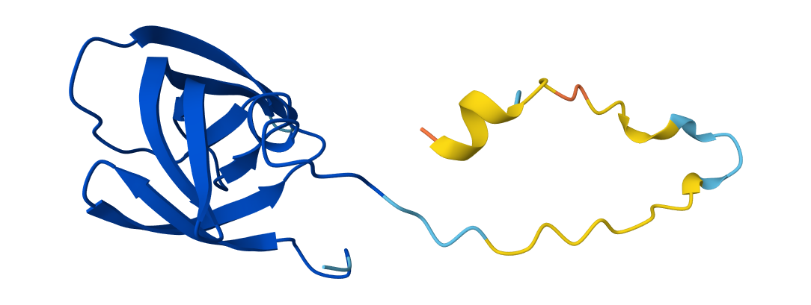
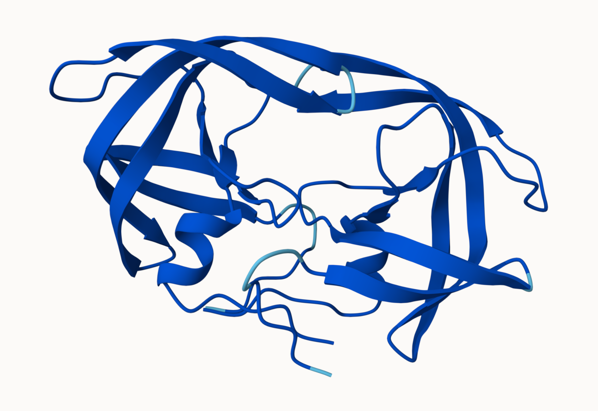
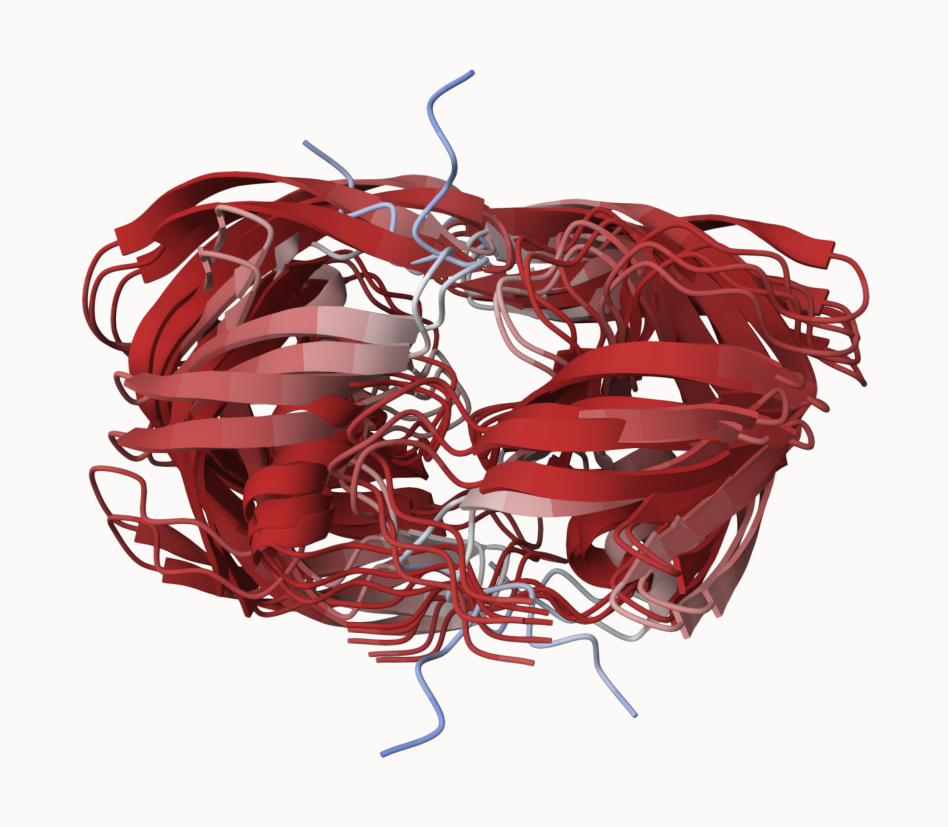

## Background

We saw last day that the main repository for biomolecular structure (the PDB database) only has ~250,000 entries.

UniProtKB (the main protein sequence database) has over 200 million entries!


## Alpha Fold

In this hands-on session we will utilize AlphaFold to predict protein structure from sequence (Jumper et al. 2021).

Without the aid of such approaches, it can take years of expensive laboratory work to determine the structure of just one protein. With AlphaFold we can now accurately compute a typical protein structure in as little as ten minutes.

## EBI AlphaFold database

The EBI AlphaFold database contains lots of computed structure models. It is increasing likely that the structure you are interested in is already in this database at <https://alphafold.ebi.ac.uk/>

There are 3 major outputs from AlphaFold:

1. A model of structure in **PDB** format.
2. A **pLDDT score** that tells us how confident the model is for a given residue in your protein (high values are good, above 70).
3. A **PAE score** that tells us about protein packing quality.


If you can't find a matching entry for the sequence you are interested in in AFDB, you can run AlphaFold yourself...



## Running the AlphaFold

We will use ColabFold to run AlphaFold on our sequence <https://colab.research.google.com/github/sokrypton/ColabFold/blob/main/AlphaFold2.ipynb>



## Interpreting Results
Custom Analysis of resulting models

We can read all the AlphaFold results into R and do more quantitative analysis than just viewing the structures in Mol-star:

Read all the PDB models:
```{r}
library(bio3d)

```

```{r}
# Change this for YOUR results dir name
results_dir <- "HIVpr_23119/" 

# File names for all PDB models
pdb_files <- list.files(path=results_dir,
                        pattern="*.pdb",
                        full.names = TRUE)
pdbs <- pdbaln(pdb_files, fit=TRUE, exefile="msa")
```

```{r}
#library(bio3dview)
#view.pdbs(pdbs)
```


How similar or different are my models?
```{r}
rd <- rmsd(pdbs)

library(pheatmap)
colnames(rd) <- paste0("m",1:5)
rownames(rd) <- paste0("m",1:5)
pheatmap(rd)
```

## Now lets plot the pLDDT values across models

```{r}
pdb <- read.pdb("1hsg")
```

Find the "rigid core" across all models:

```{r}
core <- core.find(pdbs)
# Use the core atom positions for a more suitable superposition: 
core.inds <- print(core,vol=0.5)
```




Now we look at RMSF between positions of the structure:

```{r}
xyz <- pdbfit(pdbs, core.inds, outpath="corefit_structures")
```

```{r}
rf <- rmsf(xyz)

plotb3(rf, sse=pdb)
abline(v=100, col="gray", ylab="RMSF")
```

### Predicted Alignment Error (PAE) for Domains

AlphaFold produces PAE output, detailed in JSON format (one for each structure)

```{r}
library(jsonlite)

# Listing of all PAE JSON files
pae_files <- list.files(path=results_dir,
                        pattern=".*model.*\\.json",
                        full.names = TRUE)
```

Let's read the first and fifth files:

```{r}
pae1 <- read_json(pae_files[1],simplifyVector = TRUE)
pae5 <- read_json(pae_files[5],simplifyVector = TRUE)

attributes(pae1)
```

```{r}
# Per-residue pLDDT scores 
#  same as B-factor of PDB..
head(pae1$plddt) 
```

The lower the max PAE score the better...

```{r}
pae1$max_pae
```

```{r}
pae5$max_pae
```

### Plot N by N (number of residues)

Plot for Model 1:

```{r}
plot.dmat(pae1$pae, 
          xlab="Residue Position (i)",
          ylab="Residue Position (j)",
          grid.col = "black",
          zlim=c(0,30))
```

Plot for Model 5:

```{r}
plot.dmat(pae5$pae, 
          xlab="Residue Position (i)",
          ylab="Residue Position (j)",
          grid.col = "black",
          zlim=c(0,30))
```

### Residue Conservation from Alignment File

```{r}
aln_file <- list.files(path=results_dir,
                       pattern=".a3m$",
                        full.names = TRUE)
aln_file
```

```{r}
aln <- read.fasta(aln_file[1], to.upper = TRUE)
```

Number of sequences in the alignment:
```{r}
dim(aln$ali)
```

Score the residue conservation:

```{r}
sim <- conserv(aln)
plotb3(sim[1:99], sse=trim.pdb(pdb, chain="A"),
       ylab="Conservation Score")
```

Conserved active site residues D25, T26, G27, and A28 confirmed:

```{r}
con <- consensus(aln, cutoff = 0.9)
con$seq
```


