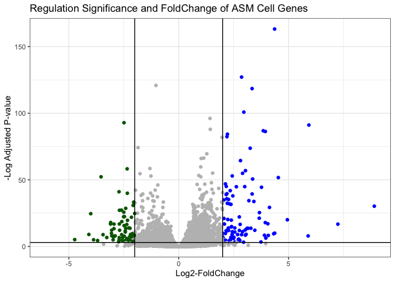

# class13: Transcriptomics & RNA-Seq Data Analysis Using DESeq
Leah Johnson, PID: A17394690

- [Background](#background)
- [Bioconductor Setup](#bioconductor-setup)
  - [Load “BioManager” to install
    “DESeq2”](#load-biomanager-to-install-deseq2)
- [Import Data](#import-data)
- [Differential gene expression](#differential-gene-expression)
- [DESeq analysis](#deseq-analysis)
- [PCA](#pca)
- [Run the DESeq analysis pipeline](#run-the-deseq-analysis-pipeline)
- [Volcano Plot](#volcano-plot)
  - [Adding some color annotation](#adding-some-color-annotation)
- [Save our results](#save-our-results)
- [Add annotation data](#add-annotation-data)
- [Save annotated results to CSV
  file](#save-annotated-results-to-csv-file)
- [Pathway Analysis](#pathway-analysis)

## Background

Today we will perform an RNASeq analysis of the effects of a common
steroid on airway cells.

In particular, dexamethasone (herafter just called “dex”) on different
airway smooth muscle cell lines (ASM cells)

# Bioconductor Setup

### Load “BioManager” to install “DESeq2”

``` r
library(BiocManager)
```

``` r
library(DESeq2)
```

``` r
library(ggplot2)
```

# Import Data

We need two different inputs: 1. **countData**: with genes in rows and
experiments in columns 2. **colData**: meta data that describes the
columns in countData

``` r
counts <- read.csv("airway_scaledcounts.csv", row.names=1)
metadata <-  read.csv("airway_metadata.csv")
```

Let’s look at the counts and metadata:

``` r
head(counts)
```

                    SRR1039508 SRR1039509 SRR1039512 SRR1039513 SRR1039516
    ENSG00000000003        723        486        904        445       1170
    ENSG00000000005          0          0          0          0          0
    ENSG00000000419        467        523        616        371        582
    ENSG00000000457        347        258        364        237        318
    ENSG00000000460         96         81         73         66        118
    ENSG00000000938          0          0          1          0          2
                    SRR1039517 SRR1039520 SRR1039521
    ENSG00000000003       1097        806        604
    ENSG00000000005          0          0          0
    ENSG00000000419        781        417        509
    ENSG00000000457        447        330        324
    ENSG00000000460         94        102         74
    ENSG00000000938          0          0          0

``` r
head(metadata)
```

              id     dex celltype     geo_id
    1 SRR1039508 control   N61311 GSM1275862
    2 SRR1039509 treated   N61311 GSM1275863
    3 SRR1039512 control  N052611 GSM1275866
    4 SRR1039513 treated  N052611 GSM1275867
    5 SRR1039516 control  N080611 GSM1275870
    6 SRR1039517 treated  N080611 GSM1275871

> Q1. How many genes are in this dataset?

There are 38694 genes in this dataset.

``` r
nrow(counts)
```

    [1] 38694

> Q2. How many ‘control’ cell lines do we have?

There are 4 ‘control’ cell lines in the dataset.

``` r
sum(metadata$dex == "control")
```

    [1] 4

``` r
table(metadata$dex)
```


    control treated 
          4       4 

# Differential gene expression

We have 4 replicate drug “treated” and “control” (no drug)
columns/experiments in our ‘counts’ object.

We want one “mean” value for each gene (rows) in “treated” (drug) and
one “mean” value for each gene in “control” cols.

Step 1. Find all “control” cols in ‘counts’ Step 2. Extract these
columns to a new object called ‘control.counts’ Step 3. Then calculate
the mean value for each gene

Step 1.

``` r
control.inds <- metadata$dex =="control"
```

Step 2.

``` r
control.counts <- counts[ , control.inds]
```

Step 3.

``` r
control.mean <- rowMeans(control.counts)
head(control.mean)
```

    ENSG00000000003 ENSG00000000005 ENSG00000000419 ENSG00000000457 ENSG00000000460 
             900.75            0.00          520.50          339.75           97.25 
    ENSG00000000938 
               0.75 

> Q3. How did you make the above code in either approach more robust? Is
> there a function that could help here?

The function ‘rowSums()’ (or ‘rowMeans()’) can be used to provide the
mean.

> Q4. Follow the same procedure for the treated samples (i.e. calculate
> the mean per gene across drug treated samples and assign to a labeled
> vector called treated.mean)

Step 1.

``` r
treated.inds <- metadata$dex =="treated"
```

Step 2.

``` r
treated.counts <- counts[ , treated.inds]
```

Step 3.

``` r
treated.mean <- rowMeans(treated.counts)
head(treated.mean)
```

    ENSG00000000003 ENSG00000000005 ENSG00000000419 ENSG00000000457 ENSG00000000460 
             658.00            0.00          546.00          316.50           78.75 
    ENSG00000000938 
               0.00 

Put these together:

> Q5 (a). Create a scatter plot showing the mean of the treated samples
> against the mean of the control samples.

``` r
meancounts <- data.frame(control.mean, treated.mean)
plot(meancounts)
```


> Q5 (b).You could also use the ggplot2 package to make this figure
> producing the plot below. What geom\_?() function would you use for
> this plot?

We would use geom_point() for this plot.

``` r
ggplot(meancounts) + 
  aes(control.mean, treated.mean) + 
  geom_point()
```


Let’s log transform this count data:

> Q6. Try plotting both axes on a log scale. What is the argument to
> plot() that allows you to do this?

The argument ‘log=“xy”’ allows both axes to be plotted on a log scale.

``` r
plot(meancounts, log="xy")
```

    Warning in xy.coords(x, y, xlabel, ylabel, log): 15032 x values <= 0 omitted
    from logarithmic plot

    Warning in xy.coords(x, y, xlabel, ylabel, log): 15281 y values <= 0 omitted
    from logarithmic plot


**N.B** We most often use log2 for this type of data as it makes the
interpretation more straightforward.

Treated/Control is often called “fold-change”

If there is no change, we would have a log2-fc of zero:

``` r
log2(10/10)
```

    [1] 0

If we had double the amount of transcript around, we would have a
log2-fc of 1:

``` r
log2(20/10)
```

    [1] 1

If we had half the amount of transcript around, we would have a log2-fc
of -1:

``` r
log2(5/10)
```

    [1] -1

> Q. Calculate a log2 fold change in value for all our genes and add it
> as a new column to our ‘meancounts’ object.

``` r
meancounts$log2fc <- log2( meancounts$treated.mean / meancounts$control.mean )
head(meancounts)
```

                    control.mean treated.mean      log2fc
    ENSG00000000003       900.75       658.00 -0.45303916
    ENSG00000000005         0.00         0.00         NaN
    ENSG00000000419       520.50       546.00  0.06900279
    ENSG00000000457       339.75       316.50 -0.10226805
    ENSG00000000460        97.25        78.75 -0.30441833
    ENSG00000000938         0.75         0.00        -Inf

There are some ‘funky’ log2-fc values (NaN and -Inf) here that come
about when we have 0 mean count values. NaN is returned when you divide
by zero and try to take the log. The -Inf is returned when you try to
take the log of zero. We would typically remove these genes with zero
expression.

``` r
zero.vals <- which(meancounts[,1:2]==0, arr.ind=TRUE)

to.rm <- unique(zero.vals[,1])
mycounts <- meancounts[-to.rm,]
head(mycounts)
```

                    control.mean treated.mean      log2fc
    ENSG00000000003       900.75       658.00 -0.45303916
    ENSG00000000419       520.50       546.00  0.06900279
    ENSG00000000457       339.75       316.50 -0.10226805
    ENSG00000000460        97.25        78.75 -0.30441833
    ENSG00000000971      5219.00      6687.50  0.35769358
    ENSG00000001036      2327.00      1785.75 -0.38194109

> Q7. What is the purpose of the arr.ind argument in the which()
> function call above? Why would we then take the first column of the
> output and need to call the unique() function?

The arr.ind allows which() to return the row and column positions that
have zero counts. By taking the first column of the output and then
using the unique() function makes sure none of the rows are counted
twice if it has zero entries in both samples.

> Q8. Using the up.ind vector above can you determine how many up
> regulated genes we have at the greater than 2 fc level?

There are 250 up-regulated genes at the greater than 2-fc level.

``` r
up.ind <- mycounts$log2fc > 2
down.ind <- mycounts$log2fc < (-2)
```

``` r
sum(up.ind)
```

    [1] 250

> Q9. Using the down.ind vector above can you determine how many down
> regulated genes we have at the greater than 2 fc level?

There are 367 down-regulated genes at the greater than 2-fc level.

``` r
sum(down.ind)
```

    [1] 367

> Q10. Do you trust these results? Why or why not?

I do not 100% trust these results because a ‘significance’ value was not
obtained.

# DESeq analysis

Let’s do this analysis with an estimate of statistical significance
using the **DESeq2 package**.

``` r
library(DESeq2)
```

DESeq (like many BioConductor packages) wants its input data in a very
specific way.

``` r
dds <- DESeqDataSetFromMatrix(countData = counts, 
                       colData = metadata, 
                       design = ~dex)
```

    converting counts to integer mode

    Warning in DESeqDataSet(se, design = design, ignoreRank): some variables in
    design formula are characters, converting to factors

``` r
dds
```

    class: DESeqDataSet 
    dim: 38694 8 
    metadata(1): version
    assays(1): counts
    rownames(38694): ENSG00000000003 ENSG00000000005 ... ENSG00000283120
      ENSG00000283123
    rowData names(0):
    colnames(8): SRR1039508 SRR1039509 ... SRR1039520 SRR1039521
    colData names(4): id dex celltype geo_id

# PCA

First apply a variance stabilizing transformation by calling a vst():

``` r
vsd <- vst(dds, blind = FALSE)
```

Then plot the PCA:

``` r
plotPCA(vsd, intgroup = c("dex"))
```

    using ntop=500 top features by variance


ggplot can also be used to plot the PCA, but we need to return the data
first:

``` r
pcaData <- plotPCA(vsd, intgroup=c("dex"), returnData=TRUE)
```

    using ntop=500 top features by variance

``` r
head(pcaData)
```

                      PC1        PC2   group       name         id     dex celltype
    SRR1039508 -17.607922 -10.225252 control SRR1039508 SRR1039508 control   N61311
    SRR1039509   4.996738  -7.238117 treated SRR1039509 SRR1039509 treated   N61311
    SRR1039512  -5.474456  -8.113993 control SRR1039512 SRR1039512 control  N052611
    SRR1039513  18.912974  -6.226041 treated SRR1039513 SRR1039513 treated  N052611
    SRR1039516 -14.729173  16.252000 control SRR1039516 SRR1039516 control  N080611
    SRR1039517   7.279863  21.008034 treated SRR1039517 SRR1039517 treated  N080611
                   geo_id sizeFactor
    SRR1039508 GSM1275862  1.0193796
    SRR1039509 GSM1275863  0.9005653
    SRR1039512 GSM1275866  1.1784239
    SRR1039513 GSM1275867  0.6709854
    SRR1039516 GSM1275870  1.1731984
    SRR1039517 GSM1275871  1.3929361

``` r
# Calculate percent variance per PC for the plot axis labels
percentVar <- round(100 * attr(pcaData, "percentVar"))
```

``` r
ggplot(pcaData) +
  aes(x = PC1, y = PC2, color = dex) +
  geom_point(size =3) +
  xlab(paste0("PC1: ", percentVar[1], "% variance")) +
  ylab(paste0("PC2: ", percentVar[2], "% variance")) +
  coord_fixed() +
  theme_bw()
```


# Run the DESeq analysis pipeline

The main function ‘DESeq()’

``` r
dds <- DESeq(dds)
```

    estimating size factors

    estimating dispersions

    gene-wise dispersion estimates

    mean-dispersion relationship

    final dispersion estimates

    fitting model and testing

``` r
res <- results(dds)
head(res)
```

    log2 fold change (MLE): dex treated vs control 
    Wald test p-value: dex treated vs control 
    DataFrame with 6 rows and 6 columns
                      baseMean log2FoldChange     lfcSE      stat    pvalue
                     <numeric>      <numeric> <numeric> <numeric> <numeric>
    ENSG00000000003 747.194195      -0.350703  0.168242 -2.084514 0.0371134
    ENSG00000000005   0.000000             NA        NA        NA        NA
    ENSG00000000419 520.134160       0.206107  0.101042  2.039828 0.0413675
    ENSG00000000457 322.664844       0.024527  0.145134  0.168996 0.8658000
    ENSG00000000460  87.682625      -0.147143  0.256995 -0.572550 0.5669497
    ENSG00000000938   0.319167      -1.732289  3.493601 -0.495846 0.6200029
                         padj
                    <numeric>
    ENSG00000000003  0.163017
    ENSG00000000005        NA
    ENSG00000000419  0.175937
    ENSG00000000457  0.961682
    ENSG00000000460  0.815805
    ENSG00000000938        NA

``` r
summary(res)
```


    out of 25258 with nonzero total read count
    adjusted p-value < 0.1
    LFC > 0 (up)       : 1564, 6.2%
    LFC < 0 (down)     : 1188, 4.7%
    outliers [1]       : 142, 0.56%
    low counts [2]     : 9971, 39%
    (mean count < 10)
    [1] see 'cooksCutoff' argument of ?results
    [2] see 'independentFiltering' argument of ?results

The default p-value is set to \<0.1, but we can change this:

``` r
res05 <- results(dds, alpha=0.05)
summary(res05)
```


    out of 25258 with nonzero total read count
    adjusted p-value < 0.05
    LFC > 0 (up)       : 1237, 4.9%
    LFC < 0 (down)     : 933, 3.7%
    outliers [1]       : 142, 0.56%
    low counts [2]     : 9033, 36%
    (mean count < 6)
    [1] see 'cooksCutoff' argument of ?results
    [2] see 'independentFiltering' argument of ?results

# Volcano Plot

This is a main summary results figure from these kinds of studies with
many data values. It is a plot of Log2-foldchange vs. (Adjusted)
P-value.

``` r
plot(res$log2FoldChange, 
     res$padj)
```


This y-axis needs log transformation and we can use a minus sign in
front of ‘log’ to flip the y-axis.

``` r
plot(res$log2FoldChange, 
     -log(res$padj))
abline(v=-2, col="red")
abline(v=+2, col="red")
abline(h=-log(0.05), col="red")
```


## Adding some color annotation

Start with a default base color “gray”

``` r
mycols <- rep("gray", nrow(res))
mycols[ res$log2FoldChange > 2 ] <- "blue"
mycols[ res$log2FoldChange < -2 ] <- "darkgreen"
mycols[ res$padj >= 0.05 ] <- "gray"
# color the insignificant values gray

plot(res$log2FoldChange, 
     -log(res$padj), 
     col=mycols)

abline(v=c(-2,2), col="red", lty=2)
abline(h=-log(0.05), col="red", lty=2)
```


> Q. Make a presentation quality ggplot version of this plot. Include
> clear axis labels, a clean theme, you custom cutoff lines and a plot
> title

``` r
ggplot(res) + 
  aes(log2FoldChange, 
      -log(padj)) + 
  geom_point(color=mycols) + 
  labs(x="Log2-FoldChange",
       y="-Log Adjusted P-value",
       title="Regulation Significance and FoldChange of ASM Cell Genes") +
  geom_vline(xintercept = c(-2,2)) + 
  geom_hline(yintercept = -log(0.05)) + 
  theme_bw()
```

    Warning: Removed 23549 rows containing missing values or values outside the scale range
    (`geom_point()`).



# Save our results

Write a csv file

``` r
write.csv(res, file="results")
```

# Add annotation data

We need to add missing annotation data to our main ‘res’ results object.
This includes the common gene “symbol”

``` r
head(res)
```

    log2 fold change (MLE): dex treated vs control 
    Wald test p-value: dex treated vs control 
    DataFrame with 6 rows and 6 columns
                      baseMean log2FoldChange     lfcSE      stat    pvalue
                     <numeric>      <numeric> <numeric> <numeric> <numeric>
    ENSG00000000003 747.194195      -0.350703  0.168242 -2.084514 0.0371134
    ENSG00000000005   0.000000             NA        NA        NA        NA
    ENSG00000000419 520.134160       0.206107  0.101042  2.039828 0.0413675
    ENSG00000000457 322.664844       0.024527  0.145134  0.168996 0.8658000
    ENSG00000000460  87.682625      -0.147143  0.256995 -0.572550 0.5669497
    ENSG00000000938   0.319167      -1.732289  3.493601 -0.495846 0.6200029
                         padj
                    <numeric>
    ENSG00000000003  0.163017
    ENSG00000000005        NA
    ENSG00000000419  0.175937
    ENSG00000000457  0.961682
    ENSG00000000460  0.815805
    ENSG00000000938        NA

We will use R and BioConductor to do this “ID mapping”:

``` r
library("AnnotationDbi")
library("org.Hs.eg.db")
```

Let’s see what databases we can use for translation/mapping…

``` r
columns(org.Hs.eg.db)
```

     [1] "ACCNUM"       "ALIAS"        "ENSEMBL"      "ENSEMBLPROT"  "ENSEMBLTRANS"
     [6] "ENTREZID"     "ENZYME"       "EVIDENCE"     "EVIDENCEALL"  "GENENAME"    
    [11] "GENETYPE"     "GO"           "GOALL"        "IPI"          "MAP"         
    [16] "OMIM"         "ONTOLOGY"     "ONTOLOGYALL"  "PATH"         "PFAM"        
    [21] "PMID"         "PROSITE"      "REFSEQ"       "SYMBOL"       "UCSCKG"      
    [26] "UNIPROT"     

We can use the ‘mapIds()’ function now to “translate” between any of
these databases.

``` r
res$symbol <- mapIds(org.Hs.eg.db,
                     keys=row.names(res), # Our gene-names
                     keytype="ENSEMBL", # Their format
                     column="SYMBOL") # Format we want
```

    'select()' returned 1:many mapping between keys and columns

``` r
head(res)
```

    log2 fold change (MLE): dex treated vs control 
    Wald test p-value: dex treated vs control 
    DataFrame with 6 rows and 7 columns
                      baseMean log2FoldChange     lfcSE      stat    pvalue
                     <numeric>      <numeric> <numeric> <numeric> <numeric>
    ENSG00000000003 747.194195      -0.350703  0.168242 -2.084514 0.0371134
    ENSG00000000005   0.000000             NA        NA        NA        NA
    ENSG00000000419 520.134160       0.206107  0.101042  2.039828 0.0413675
    ENSG00000000457 322.664844       0.024527  0.145134  0.168996 0.8658000
    ENSG00000000460  87.682625      -0.147143  0.256995 -0.572550 0.5669497
    ENSG00000000938   0.319167      -1.732289  3.493601 -0.495846 0.6200029
                         padj      symbol
                    <numeric> <character>
    ENSG00000000003  0.163017      TSPAN6
    ENSG00000000005        NA        TNMD
    ENSG00000000419  0.175937        DPM1
    ENSG00000000457  0.961682       SCYL3
    ENSG00000000460  0.815805       FIRRM
    ENSG00000000938        NA         FGR

> Q. Also add “ENTREZID” and “GENENAME” IDs to our ‘res’ object.

``` r
res$entrez <- mapIds(org.Hs.eg.db,
                     keys=row.names(res), # Our gene-names
                     keytype="ENSEMBL", # Their format
                     column="ENTREZID") # Format we want
```

    'select()' returned 1:many mapping between keys and columns

``` r
res$genename <- mapIds(org.Hs.eg.db,
                     keys=row.names(res), # Our gene-names
                     keytype="ENSEMBL", # Their format
                     column="GENENAME") # Format we want
```

    'select()' returned 1:many mapping between keys and columns

``` r
head(res)
```

    log2 fold change (MLE): dex treated vs control 
    Wald test p-value: dex treated vs control 
    DataFrame with 6 rows and 9 columns
                      baseMean log2FoldChange     lfcSE      stat    pvalue
                     <numeric>      <numeric> <numeric> <numeric> <numeric>
    ENSG00000000003 747.194195      -0.350703  0.168242 -2.084514 0.0371134
    ENSG00000000005   0.000000             NA        NA        NA        NA
    ENSG00000000419 520.134160       0.206107  0.101042  2.039828 0.0413675
    ENSG00000000457 322.664844       0.024527  0.145134  0.168996 0.8658000
    ENSG00000000460  87.682625      -0.147143  0.256995 -0.572550 0.5669497
    ENSG00000000938   0.319167      -1.732289  3.493601 -0.495846 0.6200029
                         padj      symbol      entrez               genename
                    <numeric> <character> <character>            <character>
    ENSG00000000003  0.163017      TSPAN6        7105          tetraspanin 6
    ENSG00000000005        NA        TNMD       64102            tenomodulin
    ENSG00000000419  0.175937        DPM1        8813 dolichyl-phosphate m..
    ENSG00000000457  0.961682       SCYL3       57147 SCY1 like pseudokina..
    ENSG00000000460  0.815805       FIRRM       55732 FIGNL1 interacting r..
    ENSG00000000938        NA         FGR        2268 FGR proto-oncogene, ..

# Save annotated results to CSV file

``` r
write.csv(res, file = "results_annotated.csv")
```

# Pathway Analysis

What known biological pathways do our differentially expressed genes
overlap with (i.e. play a role in)?

There are lots of BioConductor packages that do this type of analysis.

We will use one of the oldest called **gage** along with **pathview** to
render nice pics of the wathways we find.

We can install these with the command:
‘BiocManager::install(c(“pathview”, “gage”, “gageData”))’

``` r
library(pathview)
library(gage)
library(gageData)
```

Have a wee peek at what is in ‘gageData’

``` r
# Examine the first 2 pathways in this kegg set for humans
data(kegg.sets.hs)
head(kegg.sets.hs, 2)
```

    $`hsa00232 Caffeine metabolism`
    [1] "10"   "1544" "1548" "1549" "1553" "7498" "9"   

    $`hsa00983 Drug metabolism - other enzymes`
     [1] "10"     "1066"   "10720"  "10941"  "151531" "1548"   "1549"   "1551"  
     [9] "1553"   "1576"   "1577"   "1806"   "1807"   "1890"   "221223" "2990"  
    [17] "3251"   "3614"   "3615"   "3704"   "51733"  "54490"  "54575"  "54576" 
    [25] "54577"  "54578"  "54579"  "54600"  "54657"  "54658"  "54659"  "54963" 
    [33] "574537" "64816"  "7083"   "7084"   "7172"   "7363"   "7364"   "7365"  
    [41] "7366"   "7367"   "7371"   "7372"   "7378"   "7498"   "79799"  "83549" 
    [49] "8824"   "8833"   "9"      "978"   

The main ‘gage()’ function that does the work wants a simple vector as
input.

``` r
foldchanges <- res$log2FoldChange
names(foldchanges) <- res$symbol
head(foldchanges)
```

         TSPAN6        TNMD        DPM1       SCYL3       FIRRM         FGR 
    -0.35070296          NA  0.20610728  0.02452701 -0.14714263 -1.73228897 

The KEGG database uses ENTREZ ids so we need to provide these in our
input vector for **gage**:

``` r
names(foldchanges) <- res$entrez
```

Now we can run ‘gage()’

``` r
# Get the results
keggres = gage(foldchanges, gsets=kegg.sets.hs)
```

What is in the output object ‘keggres’?

``` r
attributes(keggres)
```

    $names
    [1] "greater" "less"    "stats"  

``` r
# Look at the first three down (less) pathways
head(keggres$less, 3)
```

                                          p.geomean stat.mean        p.val
    hsa05332 Graft-versus-host disease 0.0004250607 -3.473335 0.0004250607
    hsa04940 Type I diabetes mellitus  0.0017820379 -3.002350 0.0017820379
    hsa05310 Asthma                    0.0020046180 -3.009045 0.0020046180
                                            q.val set.size         exp1
    hsa05332 Graft-versus-host disease 0.09053792       40 0.0004250607
    hsa04940 Type I diabetes mellitus  0.14232788       42 0.0017820379
    hsa05310 Asthma                    0.14232788       29 0.0020046180

We can use the **pathview** function to render a figure of any of these
pathways along with annotations for our DEGs.

Let’s see the hsa05310 Asthma pathway in our DEGs colored up:

``` r
pathview(gene.data=foldchanges, pathway.id="hsa05310")
```


> Q. Can you render and insert here the pathway figure for
> “Graft-versus-host disease” and “Type 1 Diabetes”?

``` r
pathview(gene.data=foldchanges, pathway.id="hsa05332")
```


``` r
pathview(gene.data=foldchanges, pathway.id="hsa04940")
```


