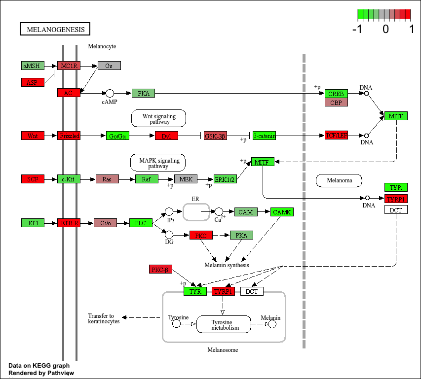
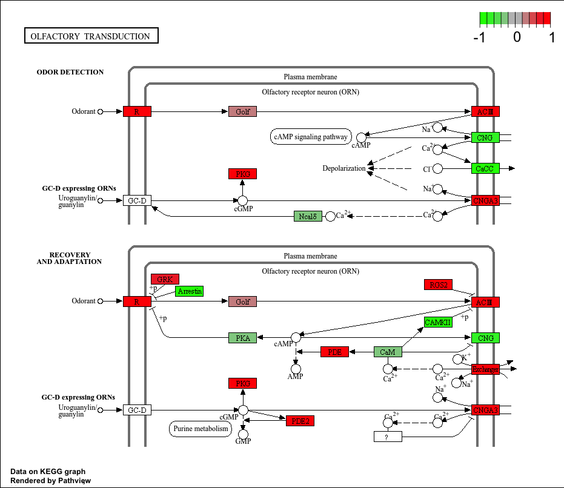

## Background


## Data Import

```{r, message=FALSE}
library(BiocManager)
library(DESeq2)
```


```{r}
metaFile <- "GSE37704_metadata.csv"
countFile <- "GSE37704_featurecounts.csv"
```


```{r}
# Import metadata
colData <- read.csv(metaFile, row.names=1)
head(colData)
```


```{r}
# Import countdata
countData = read.csv(countFile, row.names=1)
head(countData)
```


### Check and tidy

> Q. Complete the code below to remove the troublesome first column from countData

```{r}
head(countData)
```

We need to remove the first "length" column from 'countData' to have a 1:1 correspondence with 'colData' rows.

```{r}
countData <- countData[,-1]
```


```{r}
rownames(colData) == colnames(countData)
```


## Remove zero count genes

> Q. Complete the code below to filter countData to exclude genes (i.e. rows) where we have 0 read count across all samples (i.e. columns).

```{r}
to.keep <- rowSums(countData) > 0
countData <- countData[to.keep, ]
head(countData)
```


## Setup for DESeq

```{r}
library(DESeq2)
```

```{r}
dds <-  DESeqDataSetFromMatrix(countData = countData,
                               colData = colData,
                               design= ~condition)
```


### Run DESeq

```{r, message=FALSE}
dds = DESeq(dds)
```

```{r}
dds
```


### Get results

```{r}
res <- results(dds)
```


# Results

```{r}
summary(res)
```

## Volcano plot

```{r}
library(ggplot2)
```

```{r}
ggplot(res) +
  aes(log2FoldChange,
      -log(padj)) +
  geom_point()
```


## Add Annotation

> Q. Improve this plot by completing the below code, which adds color, axis labels and cutoff lines:

```{r}
mycols <- rep("gray", nrow(res))
mycols[abs(res$log2FoldChange) > 2] <- "blue"
mycols[res$padj > 0.01] <- "gray"

ggplot(res) +
  aes(log2FoldChange,
      -log(padj)) +
  geom_point(col=mycols) +
  xlab("Log2(FoldChange)") +
  ylab("-Log(P-value)") +
  geom_vline(xintercept = c(-2,2)) + 
  geom_hline(yintercept = -log(0.01))
```

## Adding gene annotation

```{r}
library("AnnotationDbi")
library("org.Hs.eg.db")
```

```{r}
columns(org.Hs.eg.db)
```

```{r}
res$symbol = mapIds(org.Hs.eg.db,
                    keys=row.names(res), 
                    keytype="ENSEMBL",
                    column="SYMBOL",
                    multiVals="first")

res$entrez = mapIds(org.Hs.eg.db,
                    keys=row.names(res),
                    keytype="ENSEMBL",
                    column="ENTREZID",
                    multiVals="first")

res$name =   mapIds(org.Hs.eg.db,
                    keys=row.names(res),
                    keytype="ENSEMBL",
                    column="GENENAME",
                    multiVals="first")

head(res, 10)
```


## Save Annotated Results

> Q. Finally for this section let's reorder these results by adjusted p-value and save them to a CSV file in your current project directory.

```{r}
res = res[order(res$pvalue),]
write.csv(res, file = "deseq_results.csv")
```


## KEGG Pathway Analysis

```{r, message=FALSE}
library(pathview)
library(gage)
library(gageData)
```


```{r}
data(kegg.sets.hs)
data(sigmet.idx.hs)
```


```{r}
# Focus on signaling and metabolic pathways only
kegg.sets.hs = kegg.sets.hs[sigmet.idx.hs]

# Examine the first 3 pathways
head(kegg.sets.hs, 3)
```


```{r}
foldchanges = res$log2FoldChange
names(foldchanges) = res$entrez
head(foldchanges)
```


```{r}
# Get the results
keggres = gage(foldchanges, gsets=kegg.sets.hs)
```


Look at the object returned from 'gage()':

```{r}
attributes(keggres)
```


```{r}
# Look at the first few down (less) pathways
head(keggres$less)
```

Add the Cell Cycle id:

```{r, message=FALSE}
pathview(gene.data=foldchanges, pathway.id="hsa04110")
```


```{r}
# A different PDF based output of the same data
pathview(gene.data=foldchanges, pathway.id="hsa04110", kegg.native=FALSE)
```


Let's obtain the top 5 upregulated pathways:

```{r}
# Focus on top 5 upregulated pathways here for demo purposes only
keggrespathways <- rownames(keggres$greater)[1:5]

# Extract the 8 character long IDs part of each string
keggresids <- substr(keggrespathways, start=1, stop=8)
keggresids
```

```{r, message=FALSE}
pathview(gene.data=foldchanges, pathway.id=keggresids, species="hsa")
```







> Q. Can you do the same procedure as above to plot the pathview figures for the top 5 down-regulated pathways?

```{r}
# Focus on top 5 downregulated pathways here for demo purposes only
keggrespathways <- rownames(keggres$less)[1:5]

# Extract the 8 character long IDs part of each string
keggresids <- substr(keggrespathways, start=1, stop=8)
keggresids
```

```{r, message=FALSE}
pathview(gene.data=foldchanges, pathway.id=keggresids, species="hsa")
```


## Gene Ontology

```{r}
data(go.sets.hs)
data(go.subs.hs)

# Focus on Biological Process subset of GO
gobpsets = go.sets.hs[go.subs.hs$BP]

gobpres = gage(foldchanges, gsets=gobpsets)

lapply(gobpres, head)
```


## Reactome Analysis

```{r}
sig_genes <- res[res$padj <= 0.05 & !is.na(res$padj), "symbol"]
print(paste("Total number of significant genes:", length(sig_genes)))
```

```{r}
write.table(sig_genes, file="significant_genes.txt", row.names=FALSE, col.names=FALSE, quote=FALSE)
```


> Q: What pathway has the most significant “Entities p-value”? Do the most significant pathways listed match your previous KEGG results? What factors could cause differences between the two methods?

The Cell Cycle (mitotic) has the most significant "Entities P-value" at 2.1E-5 on Reactome. My previous KEGG results also show that the Cell Cycle has the lowest p-value, however, the p-values are different and the KEGG results differ in the order and amount of pathways listed. Reactome provides a more detailed pathway analysis in contrast to the KEGG pathway analysis only offering signaling and metabolic pathways. 


