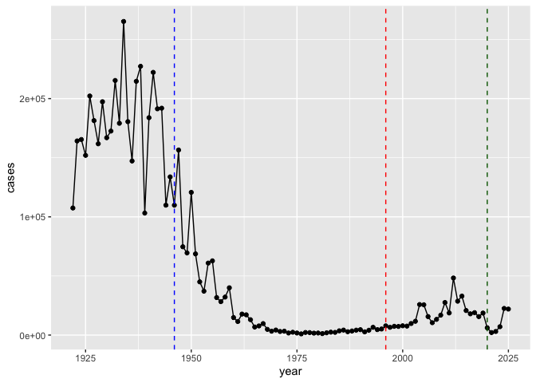
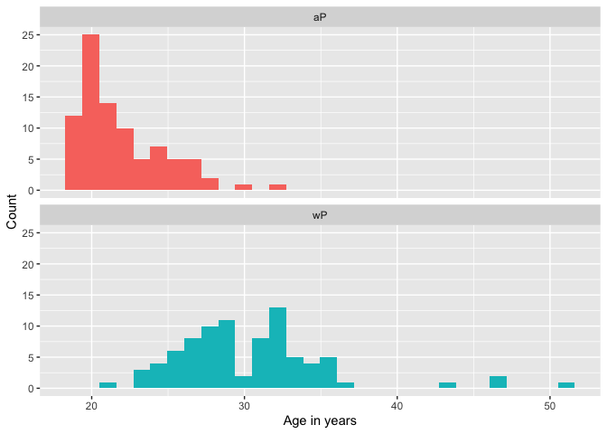
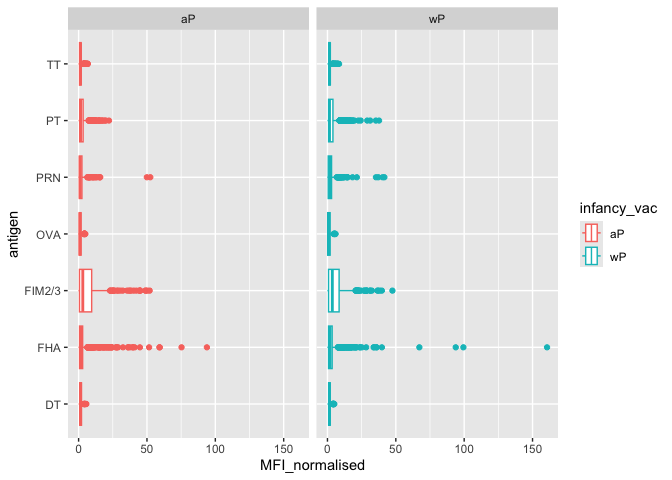
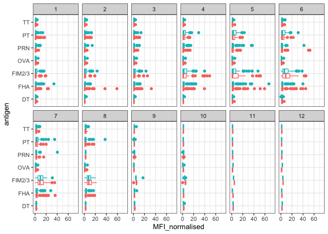
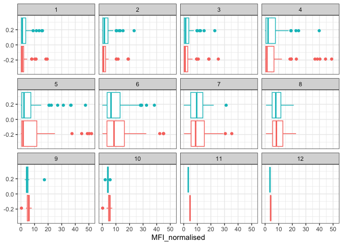
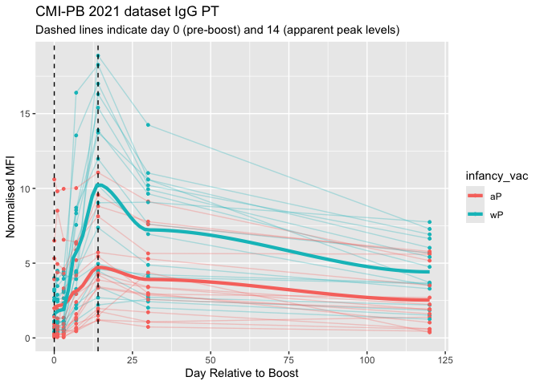
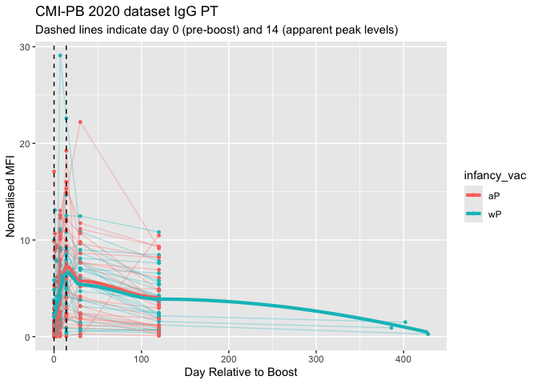
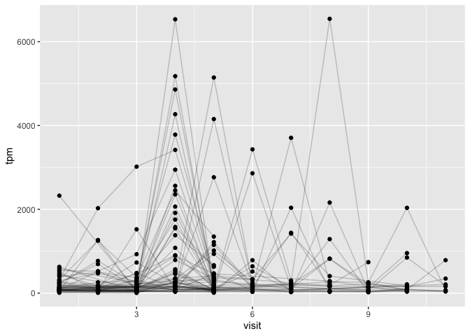

# class18_PertussisProject
Leah Johnson, PID: A17394690

- [Background](#background)
- [CDC tracking data](#cdc-tracking-data)
- [Exploring CMI-PB Data](#exploring-cmi-pb-data)
  - [Working with Dates](#working-with-dates)
- [Examine IgG ab_titer levels](#examine-igg-ab_titer-levels)
- [Obtaining CMI-PB RNASeq data](#obtaining-cmi-pb-rnaseq-data)

# Background

Pertussis (whooping cough) is a common lung infection caused by the
bacteria B. Pertussis. It can infect anyone, but is most deadly for
infants (under 1 years old).

# CDC tracking data

The CDC tracks the number of Pertussis cases.

> **Q1.** With the help of the R “Addin” package ‘datapasta()’ assign
> the CDC pertussis case number data to a data frame called cdc and use
> ggplot to make a plot of cases numbers over time.

``` r
library(ggplot2)

ggplot(cdc) + 
  aes(year, cases) + 
  geom_point() + 
  geom_line()
```


> **Q2.** Add annotation lines for the milestones of wP vaccination
> roll-out (1946) and the switch to aP vaccine (1996).

After introduction of the wP vaccine in 1946, the number of Pertussis
cases dropped, but after the introduction of the aP vaccine in 1996, the
number of Pertussis cases began to rise again.

``` r
library(ggplot2)

ggplot(cdc) + 
  aes(year, cases) + 
  geom_point() + 
  geom_line() + 
  geom_vline(xintercept = 1946, col="blue", lty=2) +
  geom_vline(xintercept = 1996, col="red", lty=2) + 
  geom_vline(xintercept = 2020, col="darkgreen", lty=2)
```



> **Q3.** Describe what happened after the introduction of the aP
> vaccine? Do you have a possible explanation for the observed trend?

After the introduction of the aP vaccine in 1996, the number of
Pertussis cases increases after the brief lag visible in the graph
above. These results could be explained by numerous factors, such as new
technology being used in hospitals to detect Pertussis virus, less
people getting the vaccine to begin with, and/or ‘waning efficacy’ of
the aP vaccine.

# Exploring CMI-PB Data

The CMI-PB project’s \< https://www.cmi-pb.org/ \> “The mission of
CMI-PB is to provide the scientific community with a comprehensive,
high-quality and freely accessible resource of Pertussis booster
vaccination.”

Make available a large dataset on the immune response to Pertussis. They
use a “booster” vaccination as a proxy for Pertussis infection.

They make their data available on JSON format API. We can read this into
R with the ‘read.json()’ function from the **jsonlite** package:

``` r
library(jsonlite)

subject <- read_json("https://www.cmi-pb.org/api/v5_1/subject",
                     simplifyVector = TRUE)
head(subject)
```

      subject_id infancy_vac biological_sex              ethnicity  race
    1          1          wP         Female Not Hispanic or Latino White
    2          2          wP         Female Not Hispanic or Latino White
    3          3          wP         Female                Unknown White
    4          4          wP           Male Not Hispanic or Latino Asian
    5          5          wP           Male Not Hispanic or Latino Asian
    6          6          wP         Female Not Hispanic or Latino White
      year_of_birth date_of_boost      dataset
    1    1986-01-01    2016-09-12 2020_dataset
    2    1968-01-01    2019-01-28 2020_dataset
    3    1983-01-01    2016-10-10 2020_dataset
    4    1988-01-01    2016-08-29 2020_dataset
    5    1991-01-01    2016-08-29 2020_dataset
    6    1988-01-01    2016-10-10 2020_dataset

> **Q4.** How many aP and wP individuals are there in this ‘subject’
> table?

``` r
subject$infancy_vac
```

      [1] "wP" "wP" "wP" "wP" "wP" "wP" "wP" "wP" "aP" "wP" "wP" "wP" "aP" "wP" "wP"
     [16] "wP" "wP" "aP" "wP" "wP" "wP" "wP" "wP" "wP" "wP" "wP" "aP" "wP" "aP" "wP"
     [31] "wP" "aP" "wP" "wP" "wP" "aP" "aP" "aP" "wP" "wP" "wP" "aP" "aP" "aP" "aP"
     [46] "aP" "aP" "aP" "aP" "aP" "aP" "aP" "aP" "aP" "aP" "aP" "aP" "aP" "aP" "aP"
     [61] "wP" "wP" "wP" "wP" "wP" "wP" "wP" "wP" "wP" "aP" "aP" "wP" "wP" "wP" "aP"
     [76] "aP" "wP" "wP" "wP" "wP" "wP" "aP" "aP" "aP" "aP" "aP" "aP" "aP" "aP" "aP"
     [91] "aP" "aP" "aP" "aP" "aP" "aP" "wP" "wP" "aP" "aP" "aP" "aP" "wP" "wP" "wP"
    [106] "aP" "aP" "wP" "wP" "aP" "wP" "aP" "aP" "wP" "aP" "aP" "aP" "aP" "aP" "wP"
    [121] "aP" "aP" "wP" "aP" "wP" "wP" "aP" "wP" "wP" "wP" "aP" "wP" "aP" "wP" "wP"
    [136] "wP" "aP" "aP" "wP" "aP" "wP" "aP" "aP" "aP" "aP" "wP" "aP" "wP" "wP" "wP"
    [151] "wP" "wP" "aP" "aP" "aP" "aP" "aP" "aP" "wP" "aP" "aP" "aP" "wP" "wP" "wP"
    [166] "aP" "aP" "wP" "aP" "wP" "wP" "wP"

``` r
table(subject$infancy_vac)
```


    aP wP 
    87 85 

> **Q5.** How many Male and Female subjects/patients are in the dataset?

``` r
table(subject$biological_sex)
```


    Female   Male 
       112     60 

> **Q6.** What is the breakdown of race and biological sex (e.g. number
> of Asian females, White males etc…)?

``` r
table(subject$race, subject$biological_sex)
```

                                               
                                                Female Male
      American Indian/Alaska Native                  0    1
      Asian                                         32   12
      Black or African American                      2    3
      More Than One Race                            15    4
      Native Hawaiian or Other Pacific Islander      1    1
      Unknown or Not Reported                       14    7
      White                                         48   32

> **Q6a.** Is this representative of the US population?

The White and Asian Male and Female groups have the greatest counts of
those who received the vaccination.

## Working with Dates

``` r
library(lubridate)
```


    Attaching package: 'lubridate'

    The following objects are masked from 'package:base':

        date, intersect, setdiff, union

``` r
## What is today's date?
today()
```

    [1] "2026-03-12"

``` r
## How many days have passed since new year 2000?
today() - ymd("2000-01-01")
```

    Time difference of 9567 days

``` r
## What is this in years?
time_length( today() - ymd("2000-01-01"),  "years")
```

    [1] 26.19302

> **Q7.** Using this approach determine (i) the average age of wP
> individuals, (ii) the average age of aP individuals; and (iii) are
> they significantly different?

1)  Average age of wP individuals:

``` r
library(dplyr)
```


    Attaching package: 'dplyr'

    The following objects are masked from 'package:stats':

        filter, lag

    The following objects are masked from 'package:base':

        intersect, setdiff, setequal, union

``` r
wp <- subject %>% filter(infancy_vac == "wP")
```

``` r
wp$age <- today() - ymd(wp$year_of_birth)

mean(wp$age)
```

    Time difference of 13455.47 days

``` r
library(dplyr)

wp_age <- round( summary( time_length( wp$age, "years" ) ) )
```

2)  Average age of aP individuals:

``` r
ap <- subject %>% filter(infancy_vac == "aP")
```

``` r
ap$age <- today() - ymd(ap$year_of_birth)

mean(ap$age)
```

    Time difference of 10259.28 days

``` r
library(dplyr)

ap_age <- round( summary( time_length( ap$age, "years" ) ) )
```

> **Q8.** Determine the age of all individuals at time of boost?

``` r
int <- ymd(subject$date_of_boost) - ymd(subject$year_of_birth)

age_at_boost <- time_length(int, "year")
head(age_at_boost)
```

    [1] 30.69678 51.07461 33.77413 28.65982 25.65914 28.77481

> **Q9.** With the help of a faceted boxplot or histogram (see below),
> do you think these two groups are significantly different?

``` r
ggplot(subject) +
  aes(age_at_boost, fill=infancy_vac) +
  geom_histogram(show.legend=FALSE) +
  facet_wrap(vars(infancy_vac), nrow=2) +
  xlab("Age in years") + 
  ylab("Count")
```

    `stat_bin()` using `bins = 30`. Pick better value `binwidth`.



Based on the spread of data seen in the histograms above, the aP and wP
groups differ in the ages of all individuals at the time of the boost.
The mean of individuals for aP is approximately 20 years old and the
mean age of individuals for wP is approximately 32 years old. The
p-value suggests the differenced between ages of indivuals at the time
of the boost for aP and wP is significant:

``` r
x <- t.test(time_length( wp$age, "years" ),
       time_length( ap$age, "years" ))

x$p.value
```

    [1] 2.372101e-23

We can read more tables from the CMI-PB database:

``` r
specimen <- read_json("https://www.cmi-pb.org/api/v5_1/specimen",
                      simplifyVector = TRUE)
ab_titer <- read_json("https://www.cmi-pb.org/api/v5_1/plasma_ab_titer",
                      simplifyVector = TRUE)
```

``` r
head(specimen)
```

      specimen_id subject_id actual_day_relative_to_boost
    1           1          1                           -3
    2           2          1                            1
    3           3          1                            3
    4           4          1                            7
    5           5          1                           11
    6           6          1                           32
      planned_day_relative_to_boost specimen_type visit
    1                             0         Blood     1
    2                             1         Blood     2
    3                             3         Blood     3
    4                             7         Blood     4
    5                            14         Blood     5
    6                            30         Blood     6

``` r
head(ab_titer)
```

      specimen_id isotype is_antigen_specific antigen        MFI MFI_normalised
    1           1     IgE               FALSE   Total 1110.21154       2.493425
    2           1     IgE               FALSE   Total 2708.91616       2.493425
    3           1     IgG                TRUE      PT   68.56614       3.736992
    4           1     IgG                TRUE     PRN  332.12718       2.602350
    5           1     IgG                TRUE     FHA 1887.12263      34.050956
    6           1     IgE                TRUE     ACT    0.10000       1.000000
       unit lower_limit_of_detection
    1 UG/ML                 2.096133
    2 IU/ML                29.170000
    3 IU/ML                 0.530000
    4 IU/ML                 6.205949
    5 IU/ML                 4.679535
    6 IU/ML                 2.816431

To make sense of this data, we need to “join” (a.k.a “merge” or “link”)
all these tables together. Only then will you know that a given
anti-body measurement (from the ‘ab_titer’ table) was collected on a
certain date (from the ‘specimen’ table) from a certain wP or aP subject
(from the ‘subject’ table).

We can use **dplyr** and the ’\*\_join()’ family of functions to do
this.

> **Q9.** Complete the code to join specimen and subject tables to make
> a new merged data frame containing all specimen records along with
> their associated subject details:

``` r
library(dplyr)

meta <- inner_join(subject, specimen)
```

    Joining with `by = join_by(subject_id)`

``` r
head(meta)
```

      subject_id infancy_vac biological_sex              ethnicity  race
    1          1          wP         Female Not Hispanic or Latino White
    2          1          wP         Female Not Hispanic or Latino White
    3          1          wP         Female Not Hispanic or Latino White
    4          1          wP         Female Not Hispanic or Latino White
    5          1          wP         Female Not Hispanic or Latino White
    6          1          wP         Female Not Hispanic or Latino White
      year_of_birth date_of_boost      dataset specimen_id
    1    1986-01-01    2016-09-12 2020_dataset           1
    2    1986-01-01    2016-09-12 2020_dataset           2
    3    1986-01-01    2016-09-12 2020_dataset           3
    4    1986-01-01    2016-09-12 2020_dataset           4
    5    1986-01-01    2016-09-12 2020_dataset           5
    6    1986-01-01    2016-09-12 2020_dataset           6
      actual_day_relative_to_boost planned_day_relative_to_boost specimen_type
    1                           -3                             0         Blood
    2                            1                             1         Blood
    3                            3                             3         Blood
    4                            7                             7         Blood
    5                           11                            14         Blood
    6                           32                            30         Blood
      visit
    1     1
    2     2
    3     3
    4     4
    5     5
    6     6

> **Q10.** Now using the same procedure join meta with titer data so we
> can further analyze this data in terms of time of visit aP/wP,
> male/female etc.

Let’s do one more ‘inner_join()’ to join the ‘ab_titer’ with all our
‘meta’ data.

``` r
abdata <- inner_join(ab_titer, meta)
```

    Joining with `by = join_by(specimen_id)`

``` r
head(abdata)
```

      specimen_id isotype is_antigen_specific antigen        MFI MFI_normalised
    1           1     IgE               FALSE   Total 1110.21154       2.493425
    2           1     IgE               FALSE   Total 2708.91616       2.493425
    3           1     IgG                TRUE      PT   68.56614       3.736992
    4           1     IgG                TRUE     PRN  332.12718       2.602350
    5           1     IgG                TRUE     FHA 1887.12263      34.050956
    6           1     IgE                TRUE     ACT    0.10000       1.000000
       unit lower_limit_of_detection subject_id infancy_vac biological_sex
    1 UG/ML                 2.096133          1          wP         Female
    2 IU/ML                29.170000          1          wP         Female
    3 IU/ML                 0.530000          1          wP         Female
    4 IU/ML                 6.205949          1          wP         Female
    5 IU/ML                 4.679535          1          wP         Female
    6 IU/ML                 2.816431          1          wP         Female
                   ethnicity  race year_of_birth date_of_boost      dataset
    1 Not Hispanic or Latino White    1986-01-01    2016-09-12 2020_dataset
    2 Not Hispanic or Latino White    1986-01-01    2016-09-12 2020_dataset
    3 Not Hispanic or Latino White    1986-01-01    2016-09-12 2020_dataset
    4 Not Hispanic or Latino White    1986-01-01    2016-09-12 2020_dataset
    5 Not Hispanic or Latino White    1986-01-01    2016-09-12 2020_dataset
    6 Not Hispanic or Latino White    1986-01-01    2016-09-12 2020_dataset
      actual_day_relative_to_boost planned_day_relative_to_boost specimen_type
    1                           -3                             0         Blood
    2                           -3                             0         Blood
    3                           -3                             0         Blood
    4                           -3                             0         Blood
    5                           -3                             0         Blood
    6                           -3                             0         Blood
      visit
    1     1
    2     1
    3     1
    4     1
    5     1
    6     1

> **Q11.** How many different Ab “isotype” values are in this dataset?

``` r
table(abdata$isotype)
```


      IgE   IgG  IgG1  IgG2  IgG3  IgG4 
     6698  7265 11993 12000 12000 12000 

> **Q11a.** How many different “antigen” values are measured?

``` r
table(abdata$antigen)
```


        ACT   BETV1      DT   FELD1     FHA  FIM2/3   LOLP1     LOS Measles     OVA 
       1970    1970    6318    1970    6712    6318    1970    1970    1970    6318 
        PD1     PRN      PT     PTM   Total      TT 
       1970    6712    6712    1970     788    6318 

> **Q12.** How many different “dataset” values are measured?

``` r
table(abdata$dataset)
```


    2020_dataset 2021_dataset 2022_dataset 2023_dataset 
           31520         8085         7301        15050 

# Examine IgG ab_titer levels

Let’s focus on IgG isotype: (“\|\>” or “%\>%”)

``` r
igg <- abdata |>
  filter(isotype=="IgG")

head(igg)
```

      specimen_id isotype is_antigen_specific antigen        MFI MFI_normalised
    1           1     IgG                TRUE      PT   68.56614       3.736992
    2           1     IgG                TRUE     PRN  332.12718       2.602350
    3           1     IgG                TRUE     FHA 1887.12263      34.050956
    4          19     IgG                TRUE      PT   20.11607       1.096366
    5          19     IgG                TRUE     PRN  976.67419       7.652635
    6          19     IgG                TRUE     FHA   60.76626       1.096457
       unit lower_limit_of_detection subject_id infancy_vac biological_sex
    1 IU/ML                 0.530000          1          wP         Female
    2 IU/ML                 6.205949          1          wP         Female
    3 IU/ML                 4.679535          1          wP         Female
    4 IU/ML                 0.530000          3          wP         Female
    5 IU/ML                 6.205949          3          wP         Female
    6 IU/ML                 4.679535          3          wP         Female
                   ethnicity  race year_of_birth date_of_boost      dataset
    1 Not Hispanic or Latino White    1986-01-01    2016-09-12 2020_dataset
    2 Not Hispanic or Latino White    1986-01-01    2016-09-12 2020_dataset
    3 Not Hispanic or Latino White    1986-01-01    2016-09-12 2020_dataset
    4                Unknown White    1983-01-01    2016-10-10 2020_dataset
    5                Unknown White    1983-01-01    2016-10-10 2020_dataset
    6                Unknown White    1983-01-01    2016-10-10 2020_dataset
      actual_day_relative_to_boost planned_day_relative_to_boost specimen_type
    1                           -3                             0         Blood
    2                           -3                             0         Blood
    3                           -3                             0         Blood
    4                           -3                             0         Blood
    5                           -3                             0         Blood
    6                           -3                             0         Blood
      visit
    1     1
    2     1
    3     1
    4     1
    5     1
    6     1

> **Q13.** Make a summary boxplot of ab_titer levels (MFI) for all
> antigens:

Make a plot of ‘MFI_normalised’ values for all ‘antigen’ values.

``` r
ggplot(igg) + 
  aes(MFI_normalised, antigen) + 
  geom_boxplot()
```


``` r
ggplot(igg) +
  aes(MFI_normalised, antigen) +
  geom_boxplot() + 
    xlim(0,75) +
  facet_wrap(vars(visit), nrow=2)
```

    Warning: Removed 5 rows containing non-finite outside the scale range
    (`stat_boxplot()`).


> **Q14.** What antigens show differences in the level of IgG antibody
> titers recognizing them over time? Why these and not others?

The antigens “PT”, “FIM2/3”, and “FHA” appear to have the widest range
of ab titer values. The whole-cell (wP) vaccine has \[more of\] all
these elements.

> **Q14a.** Is there a difference for these responses between aP and wP
> individuals?

``` r
ggplot(igg) + 
  aes(MFI_normalised, antigen, col=infancy_vac) + 
  geom_boxplot() + 
  facet_wrap(~infancy_vac)
```



> **Q14b.** Is there a difference with time (i.e. before booster shot
> vs. after booster shot)?

The antibody levels peak in graphs 6 and 7 and then decrease.

``` r
ggplot(igg) +
  aes(MFI_normalised, antigen, col=infancy_vac ) +
  geom_boxplot(show.legend = FALSE) + 
  facet_wrap(vars(visit), nrow=2) +
  xlim(0,75) +
  theme_bw()
```

    Warning: Removed 5 rows containing non-finite outside the scale range
    (`stat_boxplot()`).



Another version:

``` r
igg %>% filter(visit != 8) %>%
ggplot() +
  aes(MFI_normalised, antigen, col=infancy_vac ) +
  geom_boxplot(show.legend = FALSE) + 
  xlim(0,75) +
  facet_wrap(vars(infancy_vac, visit), nrow=2)
```

    Warning: Removed 5 rows containing non-finite outside the scale range
    (`stat_boxplot()`).


> **Q15.** Filter to pull out only two specific antigens for analysis
> and create a boxplot for each. You can chose any you like. Below I
> picked a “control” antigen (“OVA”, that is not in our vaccines) and a
> clear antigen of interest (“PT”, Pertussis Toxin, one of the key
> virulence factors produced by the bacterium B. pertussis).

``` r
filter(igg, antigen=="OVA") %>%
  ggplot() +
  aes(MFI_normalised, col=infancy_vac) +
  geom_boxplot(show.legend = FALSE) +
  facet_wrap(vars(visit)) +
  theme_bw()
```


``` r
filter(igg, antigen=="PT") %>%
  ggplot() +
  aes(MFI_normalised, col=infancy_vac) +
  geom_boxplot(show.legend = FALSE) +
  facet_wrap(vars(visit)) +
  theme_bw()
```


``` r
filter(igg, antigen=="FIM2/3") %>%
  ggplot() +
  aes(MFI_normalised, col=infancy_vac) +
  geom_boxplot(show.legend = FALSE) +
  facet_wrap(vars(visit)) +
  theme_bw()
```



> **Q16.** What do you notice about these two antigens time courses and
> the PT data in particular?

The PT, FIM2/3, and OVA increase over time, with PT exceeding the OVA
values. The PT values peak in the 5-8 region and then decrease.

> **Q17.** Do you see any clear difference in aP vs. wP responses?

The trend described in Q16 pertains to both the aP and wP response
values.

> **Q18.** Does this trend look similar for the 2020 dataset?

Generally yes, despite a couple aP and wP outliers present in the 2020
dataset.

``` r
## filter to 2021 dataset, IgG and PT only
ab.PT.21 <- abdata %>%
  filter(dataset == "2021_dataset",
         isotype == "IgG",
         antigen == "PT")

ggplot(ab.PT.21) +
  aes(x=planned_day_relative_to_boost,
      y=MFI_normalised,
      col=infancy_vac,
      group=subject_id) +
  geom_point(size=1) +
    geom_line(alpha=0.3) +
    geom_vline(xintercept=0, linetype="dashed") +
    geom_vline(xintercept=14, linetype="dashed") +
  geom_smooth(aes(x=planned_day_relative_to_boost, y=MFI_normalised, group = infancy_vac), method = "loess", span=0.2, se = FALSE, linewidth = 1.5) +
  labs(title="CMI-PB 2021 dataset IgG PT",
       subtitle = "Dashed lines indicate day 0 (pre-boost) and 14 (apparent peak levels)") + 
    xlab("Day Relative to Boost") + 
    ylab("Normalised MFI")
```

    `geom_smooth()` using formula = 'y ~ x'



``` r
## filter to 2020 dataset, IgG and PT only
ab.PT.20 <- abdata %>%
  filter(dataset == "2020_dataset",
         isotype == "IgG",
         antigen == "PT")

ggplot(ab.PT.20) +
  aes(x=planned_day_relative_to_boost,
      y=MFI_normalised,
      col=infancy_vac,
      group=subject_id) +
  geom_point(size=1) +
    geom_line(alpha=0.3) +
    geom_vline(xintercept=0, linetype="dashed") +
    geom_vline(xintercept=14, linetype="dashed") +
  geom_smooth(aes(x=planned_day_relative_to_boost, y=MFI_normalised, group = infancy_vac), method = "loess", span=0.2, se = FALSE, linewidth = 1.5) +
  labs(title="CMI-PB 2020 dataset IgG PT",
       subtitle = "Dashed lines indicate day 0 (pre-boost) and 14 (apparent peak levels)") + 
    xlab("Day Relative to Boost") + 
    ylab("Normalised MFI")
```

    `geom_smooth()` using formula = 'y ~ x'



# Obtaining CMI-PB RNASeq data

``` r
url <- "https://www.cmi-pb.org/api/v2/rnaseq?versioned_ensembl_gene_id=eq.ENSG00000211896.7"

rna <- read_json(url, simplifyVector = TRUE) 
```

Join ‘rna’ with ‘meta’

``` r
ssrna <- inner_join(rna, meta)
```

    Joining with `by = join_by(specimen_id)`

> **Q19.** Make a plot of the time course of gene expression for IGHG1
> gene (i.e. a plot of visit vs. tpm).

``` r
ggplot(ssrna) +
  aes(visit, tpm, group=subject_id) +
  geom_point() +
  geom_line(alpha=0.2)
```



> **Q20.** What do you notice about the expression of this gene
> (i.e. when is it at it’s maximum level)?

The maximum expression of this gene is around visit 4.

> **Q21.** Does this pattern in time match the trend of antibody titer
> data? If not, why not?

The max expression of this IGHG1 gene occurs earlier than the max
expression of the previously explored antigens. However, the timing of
max gene expression between the IGHG1 gene and other mentioned antigens
is very close. This could be explained by the longer amount of time it
takes for cells to produce antigens, and for antigen expression to,
therefore, occur, in contrast to gene expression.

``` r
ggplot(ssrna) +
  aes(tpm, col=infancy_vac) +
  geom_boxplot() +
  facet_wrap(vars(visit))
```


No difference in wP and aP, even if we focus on a particular visit.

``` r
ssrna %>%  
  filter(visit==4) %>% 
  ggplot() +
    aes(tpm, col=infancy_vac) + geom_density() + 
    geom_rug() 
```


