# class07: Machine Learning 1
Leah Johnson, PID: A17394690

- [Background](#background)
- [K-means clustering](#k-means-clustering)
- [Hierarchical clustering](#hierarchical-clustering)
- [Principal Component Analysis
  (PCA)](#principal-component-analysis-pca)
- [PCA of UK food data](#pca-of-uk-food-data)
- [Heatmap](#heatmap)
- [PCA to the rescue](#pca-to-the-rescue)
- [Digging deeper (variable
  loadings)](#digging-deeper-variable-loadings)

## Background

Today we will begin exploration of important machine learning methods
with a focus on **clustering** and **dimensionality reduction**.

To start testing these methods, let’s make up some sample data to
cluster where we know what the answer should be.

``` r
hist( rnorm(3000, mean=10) )
```

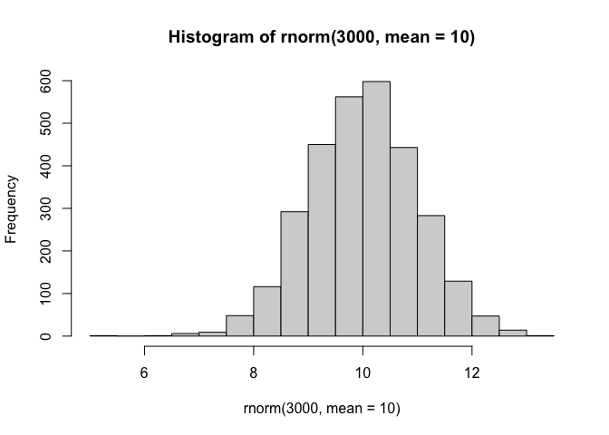

> Q. Can you generate 30 numbers centered at +3 taken at random from a
> normal distribution?

``` r
tmp <- c(rnorm(30, mean=3), rnorm(30, mean=-3))

x <- cbind(x=tmp, y=rev(tmp))
plot(x)
```

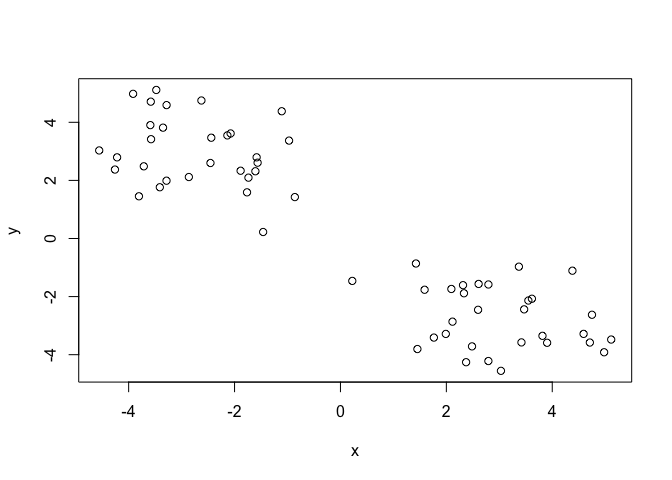

## K-means clustering

The main function in “base R” for K-means clustering is called
‘kmeans()’, let’s try it out:

``` r
k <- kmeans(x, centers=2)
k
```

    K-means clustering with 2 clusters of sizes 30, 30

    Cluster means:
              x         y
    1  2.988551 -2.705455
    2 -2.705455  2.988551

    Clustering vector:
     [1] 1 1 1 1 1 1 1 1 1 1 1 1 1 1 1 1 1 1 1 1 1 1 1 1 1 1 1 1 1 1 2 2 2 2 2 2 2 2
    [39] 2 2 2 2 2 2 2 2 2 2 2 2 2 2 2 2 2 2 2 2 2 2

    Within cluster sum of squares by cluster:
    [1] 76.17341 76.17341
     (between_SS / total_SS =  86.5 %)

    Available components:

    [1] "cluster"      "centers"      "totss"        "withinss"     "tot.withinss"
    [6] "betweenss"    "size"         "iter"         "ifault"      

> Q. What component of your kmeans result object has the cluster
> centers?

``` r
k$centers
```

              x         y
    1  2.988551 -2.705455
    2 -2.705455  2.988551

> Q. What component of your kmeans result object has the cluster size
> (i.e. how many points in each cluster?)

``` r
k$size
```

    [1] 30 30

> Q. What component of your kmeans result object has the cluster
> membership vector (i.e. the main clustering result: which points are
> in which cluster)?

``` r
k$cluster
```

     [1] 1 1 1 1 1 1 1 1 1 1 1 1 1 1 1 1 1 1 1 1 1 1 1 1 1 1 1 1 1 1 2 2 2 2 2 2 2 2
    [39] 2 2 2 2 2 2 2 2 2 2 2 2 2 2 2 2 2 2 2 2 2 2

> Q. Plot the results of clustering (i.e. our data colored by the
> clustering result) along with the cluster centers.

``` r
plot(x, col=k$cluster)
points(k$centers, col="blue", pch=15, cex=2)
```

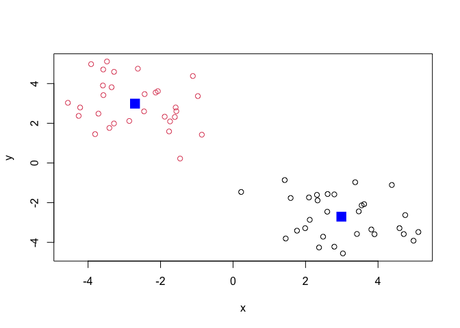

> Q. Can you run ‘kmeans()’ again, cluster ‘x’ into 4 clusters and plot
> the results just like you did above with coloring by cluster and the
> cluster centers shown in blue?

``` r
k <- kmeans(x, centers=4)
k
```

    K-means clustering with 4 clusters of sizes 15, 15, 15, 15

    Cluster means:
              x         y
    1  2.565629 -1.767327
    2 -3.643582  3.411472
    3 -1.767327  2.565629
    4  3.411472 -3.643582

    Clustering vector:
     [1] 1 4 4 1 1 1 1 4 1 4 1 4 1 4 4 4 1 1 4 4 4 1 1 4 4 4 1 1 4 1 3 2 3 3 2 2 2 3
    [39] 3 2 2 2 3 3 2 2 2 3 2 3 2 3 2 3 3 3 3 2 2 3

    Within cluster sum of squares by cluster:
    [1] 19.61977 24.78529 19.61977 24.78529
     (between_SS / total_SS =  92.1 %)

    Available components:

    [1] "cluster"      "centers"      "totss"        "withinss"     "tot.withinss"
    [6] "betweenss"    "size"         "iter"         "ifault"      

``` r
k$centers
```

              x         y
    1  2.565629 -1.767327
    2 -3.643582  3.411472
    3 -1.767327  2.565629
    4  3.411472 -3.643582

``` r
k$size
```

    [1] 15 15 15 15

``` r
k$cluster
```

     [1] 1 4 4 1 1 1 1 4 1 4 1 4 1 4 4 4 1 1 4 4 4 1 1 4 4 4 1 1 4 1 3 2 3 3 2 2 2 3
    [39] 3 2 2 2 3 3 2 2 2 3 2 3 2 3 2 3 3 3 3 2 2 3

``` r
plot(x, col=k$cluster)
points(k$centers, col="blue", pch=15, cex=2)
```

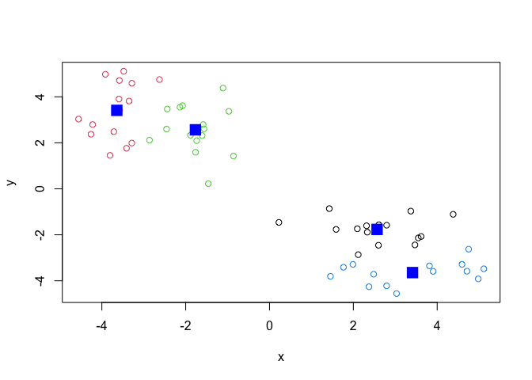

> **Key-point** K-means will always return the clustering that we ask
> for (this is the “k” or “centers” in k-means)

``` r
k$tot.withinss
```

    [1] 88.81012

## Hierarchical clustering

The main function for hierarchical clustering in base R is called
‘hclust()’. One of the main differences with respect to the ‘kmeans()’
function is that you can not just pass your input data directly to
‘hclust()’ - it needs a “distance matrix” as input. We can get this from
lot’s of places including the ‘dist()’ function.

``` r
d <- dist(x)
hc <- hclust(d)
plot(hc)
```

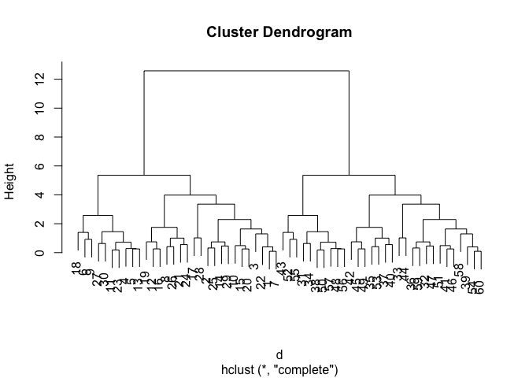

We can “cut” the dendrogram or “tree” at a given height to yield our
“clusters”. For this, we use the function ‘cutree()’.

``` r
plot(hc)
abline(h=10, col="red")
```

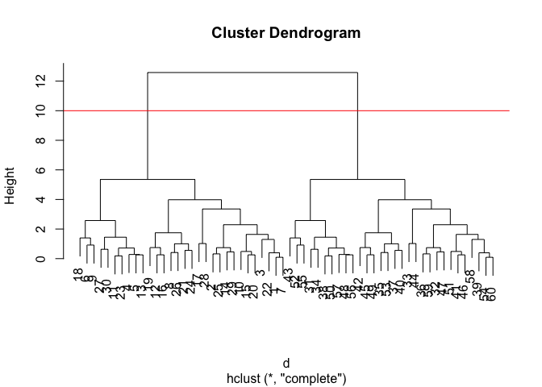

``` r
grps <- cutree(hc, h=10)
```

``` r
grps
```

     [1] 1 1 1 1 1 1 1 1 1 1 1 1 1 1 1 1 1 1 1 1 1 1 1 1 1 1 1 1 1 1 2 2 2 2 2 2 2 2
    [39] 2 2 2 2 2 2 2 2 2 2 2 2 2 2 2 2 2 2 2 2 2 2

> Q. Plot our data ‘x’ colored by the clustering result from ‘hclust()’?

``` r
grps <- cutree(hc, h=10)
plot(x, col=grps)
```

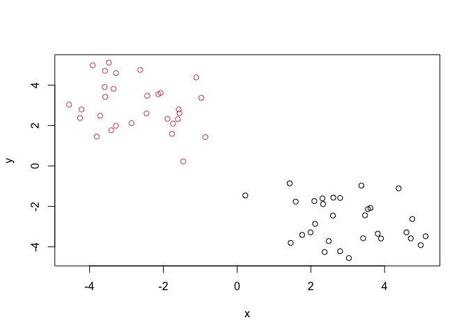

``` r
plot(hc)
abline(h=5, col="red")
```

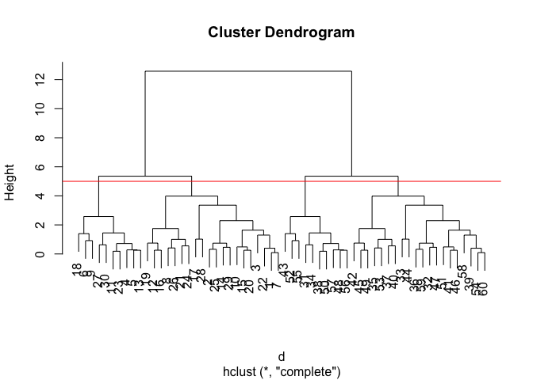

``` r
grps2 <- cutree(hc, h=5)
```

``` r
grps2
```

     [1] 1 1 1 2 2 2 1 1 2 1 2 1 2 1 1 1 1 2 1 1 1 1 2 1 1 1 2 1 1 2 3 4 4 3 4 4 4 3
    [39] 4 4 4 4 3 4 4 4 4 3 4 3 4 3 4 4 3 3 3 4 4 4

``` r
grps2 <- cutree(hc, h=5)
plot(x, col=grps2)
```

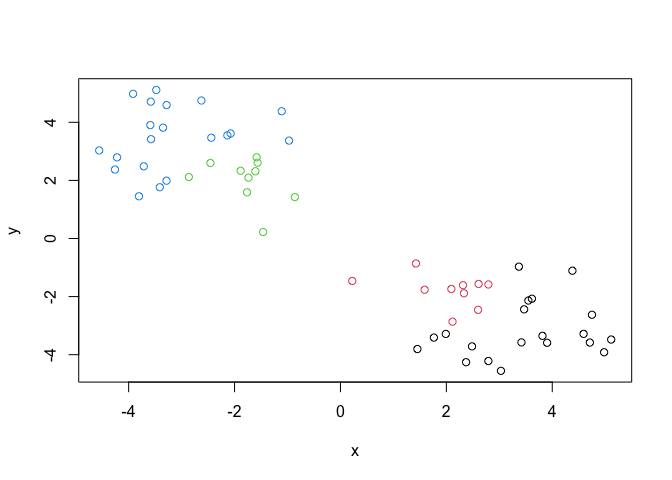

## Principal Component Analysis (PCA)

PCA is a popular dimensionality reduction technique that is widely used
in bioinformatics.

## PCA of UK food data

Read data on food consumption in the UK

``` r
url <- "https://tinyurl.com/UK-foods"
x <- read.csv(url)
x
```

                         X England Wales Scotland N.Ireland
    1               Cheese     105   103      103        66
    2        Carcass_meat      245   227      242       267
    3          Other_meat      685   803      750       586
    4                 Fish     147   160      122        93
    5       Fats_and_oils      193   235      184       209
    6               Sugars     156   175      147       139
    7      Fresh_potatoes      720   874      566      1033
    8           Fresh_Veg      253   265      171       143
    9           Other_Veg      488   570      418       355
    10 Processed_potatoes      198   203      220       187
    11      Processed_Veg      360   365      337       334
    12        Fresh_fruit     1102  1137      957       674
    13            Cereals     1472  1582     1462      1494
    14           Beverages      57    73       53        47
    15        Soft_drinks     1374  1256     1572      1506
    16   Alcoholic_drinks      375   475      458       135
    17      Confectionery       54    64       62        41

It looks like the row names are not set properly. We can fix this:

``` r
rownames(x) <- x[,1]
x <- x[,-1]
x
```

                        England Wales Scotland N.Ireland
    Cheese                  105   103      103        66
    Carcass_meat            245   227      242       267
    Other_meat              685   803      750       586
    Fish                    147   160      122        93
    Fats_and_oils           193   235      184       209
    Sugars                  156   175      147       139
    Fresh_potatoes          720   874      566      1033
    Fresh_Veg               253   265      171       143
    Other_Veg               488   570      418       355
    Processed_potatoes      198   203      220       187
    Processed_Veg           360   365      337       334
    Fresh_fruit            1102  1137      957       674
    Cereals                1472  1582     1462      1494
    Beverages                57    73       53        47
    Soft_drinks            1374  1256     1572      1506
    Alcoholic_drinks        375   475      458       135
    Confectionery            54    64       62        41

A better way to do this is fix the row names assignment at import time:

``` r
x <- read.csv(url, row.names = 1)
```

> Q1. How many rows and columns are in your new data frame named x? What
> R functions could you use to answer this questions?

``` r
dim(x)
```

    [1] 17  4

> Q2. Which approach to solving the ‘row-names problem’ mentioned above
> do you prefer and why? Is one approach more robust than another under
> certain circumstances?

I prefer the second approach to solving the ‘row-names problem’
mentioned above because it is more clear and concise.

> Q3: Changing what optional argument in the above barplot() function
> results in the following plot?

``` r
barplot(as.matrix(x), beside=FALSE, col=rainbow(nrow(x)))
```


> Q5: We can use the pairs() function to generate all pairwise plots for
> our countries. Can you make sense of the following code and resulting
> figure? What does it mean if a given point lies on the diagonal for a
> given plot?

The code compares 4 different countries (2 at a time), England, Wales,
Scotland, and N.Ireland, and each point represents one of the 17 ‘food’
groups we are concerned about. If the given point lies on the diagonal
for a given plot, it means there are the same or similar consumption
values of a specific food group for both compared countries.

``` r
pairs(x, col=rainbow(nrow(x)), pch=16)
```


## Heatmap

We can install the **pheatmap** package with the ‘install.packages()’
command that we used previously. Remember that we always run this in the
console and not a code chunk in our quarto document/

``` r
library(pheatmap)

pheatmap( as.matrix(x) )
```


Of all these plot really only the ‘pairs()’ plot was useful. This
however took a bit of work to interpret and will not scale when I am
looking at larger datasets.

> Q6. Based on the pairs and heatmap figures, which countries cluster
> together and what does this suggest about their food consumption
> patterns? Can you easily tell what the main differences between N.
> Ireland and the other countries of the UK in terms of this data-set?

Based on the pairs and heatmap figures, Whales and England cluster most
closely together, suggesting their food consumption patterns are more
similar. The dendrogram on the top of the heatmap presents a closer
clustering between Whales and England in comparison to Whales and N.
Ireland, for example. Knowing that the top dendrogram represents how
countries cluster together and the left dendrogram represents how foods
cluster together, along with the shading of the heatmap, I can eadily
tell what the main differences are between N. Ireland and the other
countries.

## PCA to the rescue

``` r
library("ggplot2")
```

The main function in “base R” for PCA is called ‘prcomp()’.

``` r
pca <- prcomp( t(x) )
summary(pca)
```

    Importance of components:
                                PC1      PC2      PC3     PC4
    Standard deviation     324.1502 212.7478 73.87622 2.7e-14
    Proportion of Variance   0.6744   0.2905  0.03503 0.0e+00
    Cumulative Proportion    0.6744   0.9650  1.00000 1.0e+00

> Q. How much variance is captured in the first PC?

67.4% variance is captured in PC1.

> Q. How many PCs do I need to capture 90% of the total variance in the
> dataset?

Two PCs capture 96.5% of the total variance.

> Q7. Plot our main PCA result. Folks can call this different things
> like “PC plot”, “ordienation plot”, “score plot”, “PC1 vs PC2 plot”,
> etc.

``` r
df <- as.data.frame(pca$x)
df$Country <- rownames(df)
ggplot(pca$x) +
  aes(x = PC1, y = PC2, label = rownames(pca$x)) +
  geom_point(size = 2) + 
  geom_text(vjust = -0.5)
```

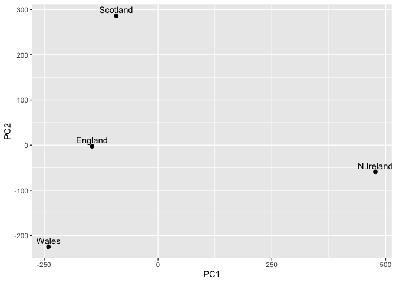

``` r
  xlab("PC1") +
  ylab("PC2") +
  theme_bw()
```

    NULL

``` r
attributes(pca)
```

    $names
    [1] "sdev"     "rotation" "center"   "scale"    "x"       

    $class
    [1] "prcomp"

To generate our PCA score plot we want the ‘pca\$x’ component of the
result object.

``` r
pca$x
```

                     PC1         PC2        PC3           PC4
    England   -144.99315   -2.532999 105.768945  1.612425e-14
    Wales     -240.52915 -224.646925 -56.475555  4.751043e-13
    Scotland   -91.86934  286.081786 -44.415495 -6.044349e-13
    N.Ireland  477.39164  -58.901862  -4.877895  1.145386e-13

> Q8. Customize your plot so that the colors of the country names match
> the colors in our UK and Ireland map and table at start of this
> document.

``` r
my_cols <- c("orange", "red", "blue", "darkgreen")
plot(pca$x[,1], pca$x[,2], col=my_cols, pch=16)
```

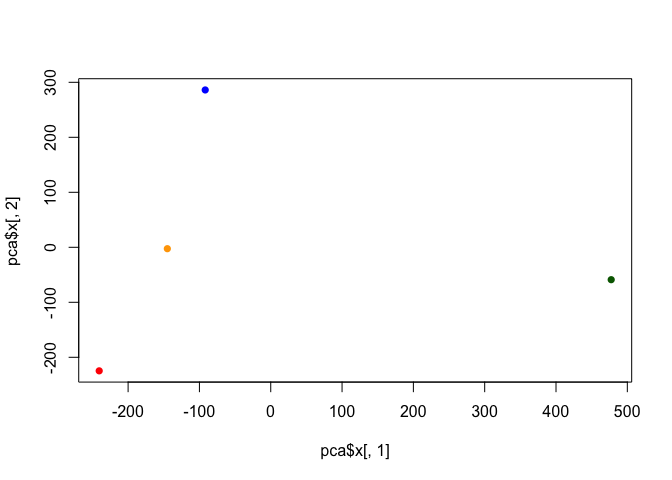

``` r
library(ggplot2)

df <- as.data.frame(pca$x)
df$Country <- rownames(df)
ggplot(pca$x) +
  aes(PC1, PC2, label = rownames(pca$x)) + 
  geom_point(col=my_cols, size = 2) + 
   geom_text(vjust = -0.5)
```

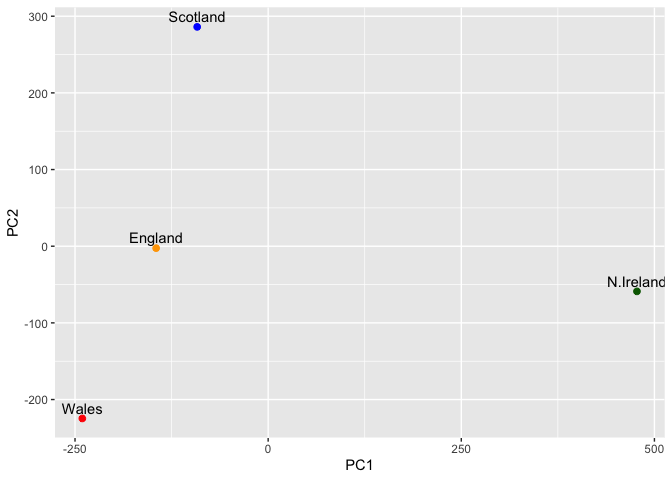

``` r
  xlab("PC1") +
  ylab("PC2") +
  theme_bw()
```

    NULL

## Digging deeper (variable loadings)

How do the original variables (i.e. the 17 different foods) contribute
to our new PCs?

> Q9: Generate a similar ‘loadings plot’ for PC2. What two food groups
> feature prominantely and what does PC2 maninly tell us about?

``` r
ggplot(pca$rotation) +
  aes(x = PC2, 
      y = reorder(rownames(pca$rotation), PC2)) +
  geom_col(fill = "steelblue") +
  xlab("PC2 Loading Score") +
  ylab("") +
  theme_bw() +
  theme(axis.text.y = element_text(size = 9))
```


This loading plot reduced the dimensions even further of the data from
the PC1 loading plot and the PC2 loading plot displays the variation in
the “largest positive loading scores” with the uppermost “soft drinks.”
