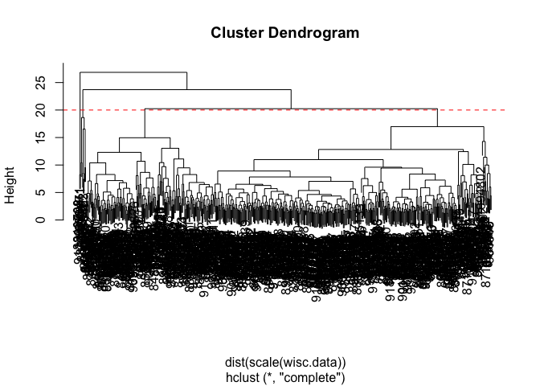
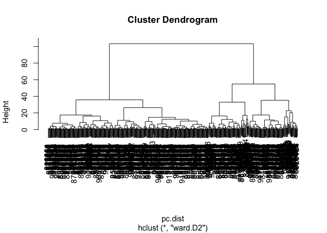
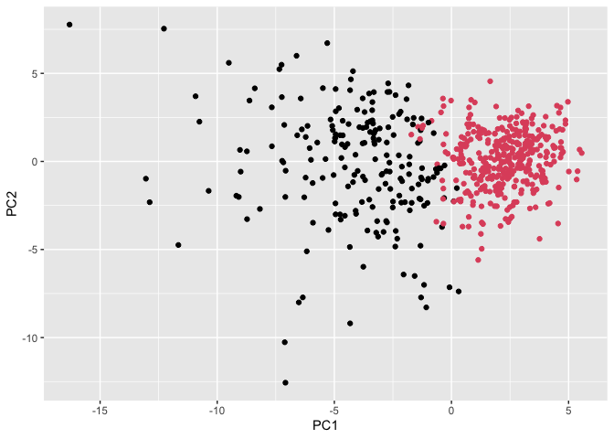

# class08 Mini Project
Leah Johnson PID: A17394690

- [Background](#background)
- [Data import](#data-import)
- [Principal Component Analysis
  (PCA)](#principal-component-analysis-pca)
- [Create a ‘biplot()’ of wisc.pr](#create-a-biplot-of-wiscpr)
- [Communicating PCA results](#communicating-pca-results)
  - [Hierarchical Clustering](#hierarchical-clustering)
  - [Clustering PCA results](#clustering-pca-results)
  - [Prediction](#prediction)

## Background

In today’s class we will apply the methods and techniques clustering and
PCA to help make sense of a real world breast cancer fine needle
aspiration (FNA) biopsy

## Data import

We start by importing the data. It is a csv file so we will use the
‘read.csv()’ function.

``` r
fna.data <- "WisconsinCancer.csv"
```

``` r
wisc.df <- read.csv(fna.data, row.names=1)
```

``` r
wisc.data <- read.csv(fna.data, row.names=1)
```

``` r
head(wisc.data)
```

             diagnosis radius_mean texture_mean perimeter_mean area_mean
    842302           M       17.99        10.38         122.80    1001.0
    842517           M       20.57        17.77         132.90    1326.0
    84300903         M       19.69        21.25         130.00    1203.0
    84348301         M       11.42        20.38          77.58     386.1
    84358402         M       20.29        14.34         135.10    1297.0
    843786           M       12.45        15.70          82.57     477.1
             smoothness_mean compactness_mean concavity_mean concave.points_mean
    842302           0.11840          0.27760         0.3001             0.14710
    842517           0.08474          0.07864         0.0869             0.07017
    84300903         0.10960          0.15990         0.1974             0.12790
    84348301         0.14250          0.28390         0.2414             0.10520
    84358402         0.10030          0.13280         0.1980             0.10430
    843786           0.12780          0.17000         0.1578             0.08089
             symmetry_mean fractal_dimension_mean radius_se texture_se perimeter_se
    842302          0.2419                0.07871    1.0950     0.9053        8.589
    842517          0.1812                0.05667    0.5435     0.7339        3.398
    84300903        0.2069                0.05999    0.7456     0.7869        4.585
    84348301        0.2597                0.09744    0.4956     1.1560        3.445
    84358402        0.1809                0.05883    0.7572     0.7813        5.438
    843786          0.2087                0.07613    0.3345     0.8902        2.217
             area_se smoothness_se compactness_se concavity_se concave.points_se
    842302    153.40      0.006399        0.04904      0.05373           0.01587
    842517     74.08      0.005225        0.01308      0.01860           0.01340
    84300903   94.03      0.006150        0.04006      0.03832           0.02058
    84348301   27.23      0.009110        0.07458      0.05661           0.01867
    84358402   94.44      0.011490        0.02461      0.05688           0.01885
    843786     27.19      0.007510        0.03345      0.03672           0.01137
             symmetry_se fractal_dimension_se radius_worst texture_worst
    842302       0.03003             0.006193        25.38         17.33
    842517       0.01389             0.003532        24.99         23.41
    84300903     0.02250             0.004571        23.57         25.53
    84348301     0.05963             0.009208        14.91         26.50
    84358402     0.01756             0.005115        22.54         16.67
    843786       0.02165             0.005082        15.47         23.75
             perimeter_worst area_worst smoothness_worst compactness_worst
    842302            184.60     2019.0           0.1622            0.6656
    842517            158.80     1956.0           0.1238            0.1866
    84300903          152.50     1709.0           0.1444            0.4245
    84348301           98.87      567.7           0.2098            0.8663
    84358402          152.20     1575.0           0.1374            0.2050
    843786            103.40      741.6           0.1791            0.5249
             concavity_worst concave.points_worst symmetry_worst
    842302            0.7119               0.2654         0.4601
    842517            0.2416               0.1860         0.2750
    84300903          0.4504               0.2430         0.3613
    84348301          0.6869               0.2575         0.6638
    84358402          0.4000               0.1625         0.2364
    843786            0.5355               0.1741         0.3985
             fractal_dimension_worst
    842302                   0.11890
    842517                   0.08902
    84300903                 0.08758
    84348301                 0.17300
    84358402                 0.07678
    843786                   0.12440

We make sure to remove the first ‘diagnosis’ column - I don’t want to
use this for my machine learning models. We will use it later to compare
our results to the expert diagnosis.

``` r
wisc.data <- wisc.df[,-1]
diagnosis <- wisc.df$diagnosis
```

> Q1. How many observations are in the dataset?

``` r
nrow(wisc.data)
```

    [1] 569

569 observations

> Q2. How many observations have a malignant diagnosis?

``` r
table(diagnosis)
```

    diagnosis
      B   M 
    357 212 

``` r
sum(wisc.df$diagnosis == "M")
```

    [1] 212

212 observations have a malignant diagnosis.

> Q3. How many variables/features in the data are suffixed with \_mean?

``` r
length( grep("_mean", colnames(wisc.df)) )
```

    [1] 10

10 variables in the data are suffixed with \_mean.

## Principal Component Analysis (PCA)

The main function here is ‘prcomp()’ and we want to make sure we set the
optional argument ‘scale=TRUE’:

``` r
wisc.pr <- prcomp(wisc.data, scale=TRUE)
summary(wisc.pr)
```

    Importance of components:
                              PC1    PC2     PC3     PC4     PC5     PC6     PC7
    Standard deviation     3.6444 2.3857 1.67867 1.40735 1.28403 1.09880 0.82172
    Proportion of Variance 0.4427 0.1897 0.09393 0.06602 0.05496 0.04025 0.02251
    Cumulative Proportion  0.4427 0.6324 0.72636 0.79239 0.84734 0.88759 0.91010
                               PC8    PC9    PC10   PC11    PC12    PC13    PC14
    Standard deviation     0.69037 0.6457 0.59219 0.5421 0.51104 0.49128 0.39624
    Proportion of Variance 0.01589 0.0139 0.01169 0.0098 0.00871 0.00805 0.00523
    Cumulative Proportion  0.92598 0.9399 0.95157 0.9614 0.97007 0.97812 0.98335
                              PC15    PC16    PC17    PC18    PC19    PC20   PC21
    Standard deviation     0.30681 0.28260 0.24372 0.22939 0.22244 0.17652 0.1731
    Proportion of Variance 0.00314 0.00266 0.00198 0.00175 0.00165 0.00104 0.0010
    Cumulative Proportion  0.98649 0.98915 0.99113 0.99288 0.99453 0.99557 0.9966
                              PC22    PC23   PC24    PC25    PC26    PC27    PC28
    Standard deviation     0.16565 0.15602 0.1344 0.12442 0.09043 0.08307 0.03987
    Proportion of Variance 0.00091 0.00081 0.0006 0.00052 0.00027 0.00023 0.00005
    Cumulative Proportion  0.99749 0.99830 0.9989 0.99942 0.99969 0.99992 0.99997
                              PC29    PC30
    Standard deviation     0.02736 0.01153
    Proportion of Variance 0.00002 0.00000
    Cumulative Proportion  1.00000 1.00000

> Q4. From your results, what proportion of the original variance is
> captured by the first principal component (PC1)?

PC1 captures 44.27% of the original variance.

> Q5. How many principal components (PCs) are required to describe at
> least 70% of the original variance in the data?

3 PCs are required to describe at least 70% of the original variance in
the data.

> Q6. How many principal components (PCs) are required to describe at
> least 90% of the original variance in the data?

7 PCs are required to describe at least 90% of the original variance in
the data.

# Create a ‘biplot()’ of wisc.pr

``` r
biplot(wisc.pr)
```


> Q7. What stands out to you about this plot? Is it easy or difficult to
> understand? Why?

I notice that the row names are the labels for each of the points,
therefore there is lots of overlapping text making the data difficult to
visualize.

Our main PCA “score plot” or “PC plot” of results:

``` r
library(ggplot2)
```

``` r
ggplot(wisc.pr$x) + 
  aes(PC1, PC2, col=diagnosis) + 
  geom_point()
```


Each point represents each benign or malignant sample and its cell
characteristics.

> Q8. Generate a similar plot for principal components 1 and 3. What do
> you notice about these plots?

I notice that majority of the points on the PC1 and PC3 plot are placed
lower on the graph, the shape is very similar to the PC1 vs. PC2 graph
and almost visually looks like a horizontally flipped version of the PC1
and PC2 graph.

``` r
ggplot(wisc.pr$x) + 
  aes(PC1, PC3, col=diagnosis) + 
  geom_point()
```


# Communicating PCA results

> Q9. For the first principal component, what is the component of the
> loading vector (i.e. wisc.pr\$rotation\[,1\]) for the feature
> concave.points_mean? This tells us how much this original feature
> contributes to the first PC. Are there any features with larger
> contributions than this one?

“wisc.pr\$rotation\[,1\]” will tell us which of the original feature
measurements contribute most to PC1. There are potential features with
larger contributions than this one.

``` r
summary(wisc.pr$rotation["concave.points_mean",1])
```

       Min. 1st Qu.  Median    Mean 3rd Qu.    Max. 
    -0.2609 -0.2609 -0.2609 -0.2609 -0.2609 -0.2609 

``` r
summary(wisc.pr$rotation["concave.points_worst",2])
```

        Min.  1st Qu.   Median     Mean  3rd Qu.     Max. 
    0.008257 0.008257 0.008257 0.008257 0.008257 0.008257 

## Hierarchical Clustering

``` r
data.scaled <- scale(wisc.data)
```

``` r
data.dist <- dist(data.scaled)
```

``` r
wisc.hclust <- hclust(data.dist, method = "complete")
```

``` r
plot(wisc.hclust)
abline(wisc.data, col="red", lty=2)
```


``` r
wisc.hclust <- hclust (dist( scale(wisc.data) ) )
plot(wisc.hclust)
```


``` r
plot(wisc.hclust)
abline(h=20, col="red", lty=2)
```



You can also use the ‘cutree()’ function with an argument of ‘k=4’
rather than ‘h=height’

``` r
wisc.hclust.clusters <- cutree(wisc.hclust, k=4)
table(wisc.hclust.clusters)
```

    wisc.hclust.clusters
      1   2   3   4 
    177   7 383   2 

## Clustering PCA results

Here we will take our PCA results and use those as input for clustering.
In other words our ‘wisc.pr\$x’ scores that we plotted above (the main
output from PCA - how the data lie on our new principal component
axis/variables) and use a subset of PCs as input for ‘hclust()’

``` r
pc.dist <- dist( wisc.pr$x[,1:3] )
wisc.pr.hclust <- hclust(pc.dist, method="ward.D2")
plot(wisc.pr.hclust)
```



> Q12. Which method gives your favorite results for the same data.dist
> dataset? Explain your reasoning.

“ward.D2” is my favorite for obtaining the same results for the same
data.dist dataset because it organizes the clusters to make the
dendrogram clearer by decreasing within-group, or within-cluster,
variance.

Cut the dendrogram/tree into two main groups/clusters:

``` r
grps <- cutree(wisc.pr.hclust, k=2)
table(grps)
```

    grps
      1   2 
    203 366 

I want to know how the clustering into ‘grps’ with values of 1 or 2
correspond the expert ‘diagnosis’

``` r
table(grps, diagnosis)
```

        diagnosis
    grps   B   M
       1  24 179
       2 333  33

My clustering **group 1** are mostly “M” diagnosis (179) and my
clustering **group 2** are mostly “B” diagnosis.

24 False positives (FP) 179 True positives (TP) 333 True negatives (TN)
33 False negatives (FN)

``` r
ggplot(wisc.pr$x) +
  aes(PC1, PC2) +
  geom_point(col=grps)
```



> Q13. How well does the newly created hclust model with two clusters
> separate out the two “M” and “B” diagnoses?

There is greater separation between “M” and “B” diagnoses with 2
clusters.

``` r
d <- dist(wisc.pr$x[, 1:7])
wisc.pr.hclust <- hclust(d, method="ward.D2")
wisc.pr.hclust.clusters <- cutree(wisc.pr.hclust, k=2)
table(wisc.pr.hclust.clusters, diagnosis)
```

                           diagnosis
    wisc.pr.hclust.clusters   B   M
                          1  28 188
                          2 329  24

> Q14. How well do the hierarchical clustering models you created in the
> previous sections (i.e. without first doing PCA) do in terms of
> separating the diagnoses? Again, use the table() function to compare
> the output of each model (wisc.hclust.clusters and
> wisc.pr.hclust.clusters) with the vector containing the actual
> diagnoses.

Prior to PCA, the separation of the diagnoses was not as concise in that
there were four clusters to consider. After PCA, there were 2 clusters
to display the greatest variation, or the greatest contributors to both
benign and malignant tumors.

``` r
table(wisc.hclust.clusters, diagnosis)
```

                        diagnosis
    wisc.hclust.clusters   B   M
                       1  12 165
                       2   2   5
                       3 343  40
                       4   0   2

## Prediction

> Q16. Which of these new patients should we prioritize for follow up
> based on your results?

Based on the new results from the new data, we should prioritize patient
2 for follow up since they fall closer to the points representing the
“M” or malignancy chunk displayed in the plot.
