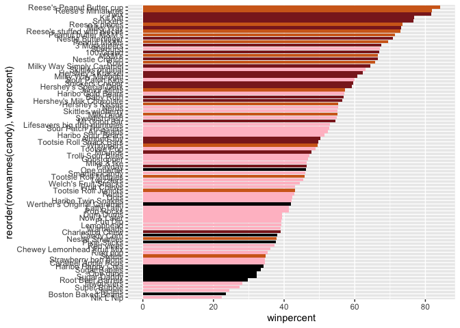
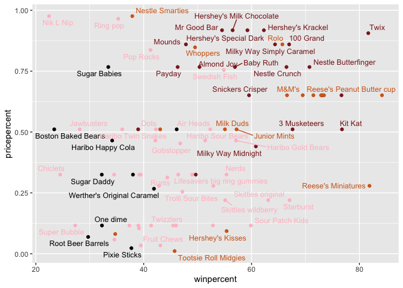
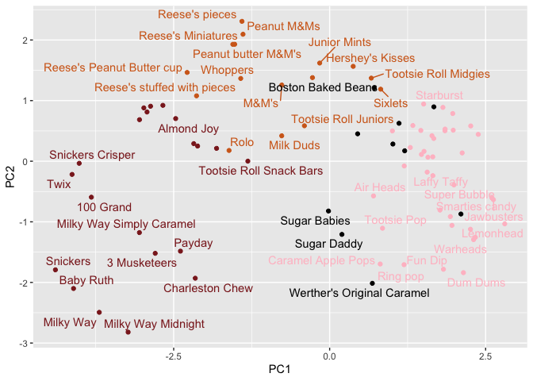
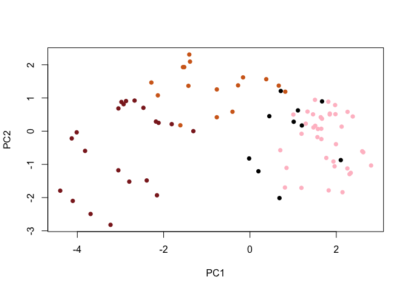
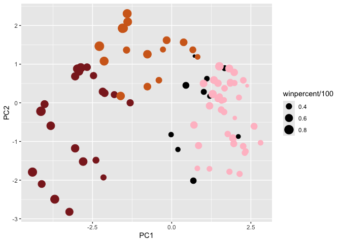
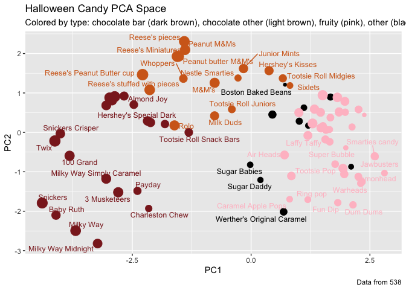

# class09 Candy Mini Project
Leah Johnson, PID: A17394690

- [Background](#background)
- [Candy Data Import](#candy-data-import)
- [skimr, ‘skim()’ function](#skimr-skim-function)
- [Exploratory analysis](#exploratory-analysis)
- [Overall Candy Rankings](#overall-candy-rankings)
- [Pricepercent](#pricepercent)
- [Exploring the Correlation
  Structure](#exploring-the-correlation-structure)
- [Principal Component Analysis
  (PCA)](#principal-component-analysis-pca)
- [Summary](#summary)

## Background

We will examine a Halloween Candy dataset from the website
“FiveThirtyEight” to determine the most enjoyed candy amongst their
readers.

## Candy Data Import

``` r
read.csv("candy-data.csv")
```

                    competitorname chocolate fruity caramel peanutyalmondy nougat
    1                    100 Grand         1      0       1              0      0
    2                 3 Musketeers         1      0       0              0      1
    3                     One dime         0      0       0              0      0
    4                  One quarter         0      0       0              0      0
    5                    Air Heads         0      1       0              0      0
    6                   Almond Joy         1      0       0              1      0
    7                    Baby Ruth         1      0       1              1      1
    8           Boston Baked Beans         0      0       0              1      0
    9                   Candy Corn         0      0       0              0      0
    10          Caramel Apple Pops         0      1       1              0      0
    11             Charleston Chew         1      0       0              0      1
    12  Chewey Lemonhead Fruit Mix         0      1       0              0      0
    13                    Chiclets         0      1       0              0      0
    14                        Dots         0      1       0              0      0
    15                    Dum Dums         0      1       0              0      0
    16                 Fruit Chews         0      1       0              0      0
    17                     Fun Dip         0      1       0              0      0
    18                  Gobstopper         0      1       0              0      0
    19           Haribo Gold Bears         0      1       0              0      0
    20           Haribo Happy Cola         0      0       0              0      0
    21           Haribo Sour Bears         0      1       0              0      0
    22          Haribo Twin Snakes         0      1       0              0      0
    23            Hershey's Kisses         1      0       0              0      0
    24           Hershey's Krackel         1      0       0              0      0
    25    Hershey's Milk Chocolate         1      0       0              0      0
    26      Hershey's Special Dark         1      0       0              0      0
    27                  Jawbusters         0      1       0              0      0
    28                Junior Mints         1      0       0              0      0
    29                     Kit Kat         1      0       0              0      0
    30                 Laffy Taffy         0      1       0              0      0
    31                   Lemonhead         0      1       0              0      0
    32 Lifesavers big ring gummies         0      1       0              0      0
    33         Peanut butter M&M's         1      0       0              1      0
    34                       M&M's         1      0       0              0      0
    35                  Mike & Ike         0      1       0              0      0
    36                   Milk Duds         1      0       1              0      0
    37                   Milky Way         1      0       1              0      1
    38          Milky Way Midnight         1      0       1              0      1
    39    Milky Way Simply Caramel         1      0       1              0      0
    40                      Mounds         1      0       0              0      0
    41                 Mr Good Bar         1      0       0              1      0
    42                       Nerds         0      1       0              0      0
    43         Nestle Butterfinger         1      0       0              1      0
    44               Nestle Crunch         1      0       0              0      0
    45                   Nik L Nip         0      1       0              0      0
    46                 Now & Later         0      1       0              0      0
    47                      Payday         0      0       0              1      1
    48                 Peanut M&Ms         1      0       0              1      0
    49                Pixie Sticks         0      0       0              0      0
    50                   Pop Rocks         0      1       0              0      0
    51                   Red vines         0      1       0              0      0
    52          Reese's Miniatures         1      0       0              1      0
    53   Reese's Peanut Butter cup         1      0       0              1      0
    54              Reese's pieces         1      0       0              1      0
    55 Reese's stuffed with pieces         1      0       0              1      0
    56                    Ring pop         0      1       0              0      0
    57                        Rolo         1      0       1              0      0
    58           Root Beer Barrels         0      0       0              0      0
    59                       Runts         0      1       0              0      0
    60                     Sixlets         1      0       0              0      0
    61           Skittles original         0      1       0              0      0
    62          Skittles wildberry         0      1       0              0      0
    63             Nestle Smarties         1      0       0              0      0
    64              Smarties candy         0      1       0              0      0
    65                    Snickers         1      0       1              1      1
    66            Snickers Crisper         1      0       1              1      0
    67             Sour Patch Kids         0      1       0              0      0
    68       Sour Patch Tricksters         0      1       0              0      0
    69                   Starburst         0      1       0              0      0
    70         Strawberry bon bons         0      1       0              0      0
    71                Sugar Babies         0      0       1              0      0
    72                 Sugar Daddy         0      0       1              0      0
    73                Super Bubble         0      1       0              0      0
    74                Swedish Fish         0      1       0              0      0
    75                 Tootsie Pop         1      1       0              0      0
    76        Tootsie Roll Juniors         1      0       0              0      0
    77        Tootsie Roll Midgies         1      0       0              0      0
    78     Tootsie Roll Snack Bars         1      0       0              0      0
    79           Trolli Sour Bites         0      1       0              0      0
    80                        Twix         1      0       1              0      0
    81                   Twizzlers         0      1       0              0      0
    82                    Warheads         0      1       0              0      0
    83        Welch's Fruit Snacks         0      1       0              0      0
    84  Werther's Original Caramel         0      0       1              0      0
    85                    Whoppers         1      0       0              0      0
       crispedricewafer hard bar pluribus sugarpercent pricepercent winpercent
    1                 1    0   1        0        0.732        0.860   66.97173
    2                 0    0   1        0        0.604        0.511   67.60294
    3                 0    0   0        0        0.011        0.116   32.26109
    4                 0    0   0        0        0.011        0.511   46.11650
    5                 0    0   0        0        0.906        0.511   52.34146
    6                 0    0   1        0        0.465        0.767   50.34755
    7                 0    0   1        0        0.604        0.767   56.91455
    8                 0    0   0        1        0.313        0.511   23.41782
    9                 0    0   0        1        0.906        0.325   38.01096
    10                0    0   0        0        0.604        0.325   34.51768
    11                0    0   1        0        0.604        0.511   38.97504
    12                0    0   0        1        0.732        0.511   36.01763
    13                0    0   0        1        0.046        0.325   24.52499
    14                0    0   0        1        0.732        0.511   42.27208
    15                0    1   0        0        0.732        0.034   39.46056
    16                0    0   0        1        0.127        0.034   43.08892
    17                0    1   0        0        0.732        0.325   39.18550
    18                0    1   0        1        0.906        0.453   46.78335
    19                0    0   0        1        0.465        0.465   57.11974
    20                0    0   0        1        0.465        0.465   34.15896
    21                0    0   0        1        0.465        0.465   51.41243
    22                0    0   0        1        0.465        0.465   42.17877
    23                0    0   0        1        0.127        0.093   55.37545
    24                1    0   1        0        0.430        0.918   62.28448
    25                0    0   1        0        0.430        0.918   56.49050
    26                0    0   1        0        0.430        0.918   59.23612
    27                0    1   0        1        0.093        0.511   28.12744
    28                0    0   0        1        0.197        0.511   57.21925
    29                1    0   1        0        0.313        0.511   76.76860
    30                0    0   0        0        0.220        0.116   41.38956
    31                0    1   0        0        0.046        0.104   39.14106
    32                0    0   0        0        0.267        0.279   52.91139
    33                0    0   0        1        0.825        0.651   71.46505
    34                0    0   0        1        0.825        0.651   66.57458
    35                0    0   0        1        0.872        0.325   46.41172
    36                0    0   0        1        0.302        0.511   55.06407
    37                0    0   1        0        0.604        0.651   73.09956
    38                0    0   1        0        0.732        0.441   60.80070
    39                0    0   1        0        0.965        0.860   64.35334
    40                0    0   1        0        0.313        0.860   47.82975
    41                0    0   1        0        0.313        0.918   54.52645
    42                0    1   0        1        0.848        0.325   55.35405
    43                0    0   1        0        0.604        0.767   70.73564
    44                1    0   1        0        0.313        0.767   66.47068
    45                0    0   0        1        0.197        0.976   22.44534
    46                0    0   0        1        0.220        0.325   39.44680
    47                0    0   1        0        0.465        0.767   46.29660
    48                0    0   0        1        0.593        0.651   69.48379
    49                0    0   0        1        0.093        0.023   37.72234
    50                0    1   0        1        0.604        0.837   41.26551
    51                0    0   0        1        0.581        0.116   37.34852
    52                0    0   0        0        0.034        0.279   81.86626
    53                0    0   0        0        0.720        0.651   84.18029
    54                0    0   0        1        0.406        0.651   73.43499
    55                0    0   0        0        0.988        0.651   72.88790
    56                0    1   0        0        0.732        0.965   35.29076
    57                0    0   0        1        0.860        0.860   65.71629
    58                0    1   0        1        0.732        0.069   29.70369
    59                0    1   0        1        0.872        0.279   42.84914
    60                0    0   0        1        0.220        0.081   34.72200
    61                0    0   0        1        0.941        0.220   63.08514
    62                0    0   0        1        0.941        0.220   55.10370
    63                0    0   0        1        0.267        0.976   37.88719
    64                0    1   0        1        0.267        0.116   45.99583
    65                0    0   1        0        0.546        0.651   76.67378
    66                1    0   1        0        0.604        0.651   59.52925
    67                0    0   0        1        0.069        0.116   59.86400
    68                0    0   0        1        0.069        0.116   52.82595
    69                0    0   0        1        0.151        0.220   67.03763
    70                0    1   0        1        0.569        0.058   34.57899
    71                0    0   0        1        0.965        0.767   33.43755
    72                0    0   0        0        0.418        0.325   32.23100
    73                0    0   0        0        0.162        0.116   27.30386
    74                0    0   0        1        0.604        0.755   54.86111
    75                0    1   0        0        0.604        0.325   48.98265
    76                0    0   0        0        0.313        0.511   43.06890
    77                0    0   0        1        0.174        0.011   45.73675
    78                0    0   1        0        0.465        0.325   49.65350
    79                0    0   0        1        0.313        0.255   47.17323
    80                1    0   1        0        0.546        0.906   81.64291
    81                0    0   0        0        0.220        0.116   45.46628
    82                0    1   0        0        0.093        0.116   39.01190
    83                0    0   0        1        0.313        0.313   44.37552
    84                0    1   0        0        0.186        0.267   41.90431
    85                1    0   0        1        0.872        0.848   49.52411

``` r
candy_file <- "candy-data.csv"
```

``` r
candy = read.csv(candy_file, row.names = 1)
head(candy)
```

                 chocolate fruity caramel peanutyalmondy nougat crispedricewafer
    100 Grand            1      0       1              0      0                1
    3 Musketeers         1      0       0              0      1                0
    One dime             0      0       0              0      0                0
    One quarter          0      0       0              0      0                0
    Air Heads            0      1       0              0      0                0
    Almond Joy           1      0       0              1      0                0
                 hard bar pluribus sugarpercent pricepercent winpercent
    100 Grand       0   1        0        0.732        0.860   66.97173
    3 Musketeers    0   1        0        0.604        0.511   67.60294
    One dime        0   0        0        0.011        0.116   32.26109
    One quarter     0   0        0        0.011        0.511   46.11650
    Air Heads       0   0        0        0.906        0.511   52.34146
    Almond Joy      0   1        0        0.465        0.767   50.34755

> Q1. How many different candy types are in this dataset?

There are 85 candy types in this dataset.

``` r
nrow(candy)
```

    [1] 85

> Q2. How many fruity candy types are in the dataset?

There are 38 fruity candies in the dataset.

``` r
sum(candy$fruity)
```

    [1] 38

> Q3. What is your favorite candy (other than Twix) in the dataset and
> what is it’s winpercent value?

The winpercent value for Snickers is approximately 76.7.

``` r
library(dplyr)
```


    Attaching package: 'dplyr'

    The following objects are masked from 'package:stats':

        filter, lag

    The following objects are masked from 'package:base':

        intersect, setdiff, setequal, union

``` r
candy |> filter(row.names(candy)=="Snickers") |>
  select(winpercent)
```

             winpercent
    Snickers   76.67378

Another way to do it…

``` r
candy["Snickers", "winpercent"]
```

    [1] 76.67378

> Q4. What is the winpercent value for “Kit Kat”?

The winpercent value for Kit Kat is approximately 76.8.

``` r
candy |> filter(row.names(candy)=="Kit Kat") |>
  select(winpercent)
```

            winpercent
    Kit Kat    76.7686

> Q5. What is the winpercent value for “Tootsie Roll Snack Bars”?

The winpercent value for Tootsie Roll Snack Bar is approximately 49.7.

``` r
candy |> filter(row.names(candy)=="Tootsie Roll Snack Bars") |>
  select(winpercent)
```

                            winpercent
    Tootsie Roll Snack Bars    49.6535

## skimr, ‘skim()’ function

``` r
library("skimr")

skim(candy)
```

|                                                  |       |
|:-------------------------------------------------|:------|
| Name                                             | candy |
| Number of rows                                   | 85    |
| Number of columns                                | 12    |
| \_\_\_\_\_\_\_\_\_\_\_\_\_\_\_\_\_\_\_\_\_\_\_   |       |
| Column type frequency:                           |       |
| numeric                                          | 12    |
| \_\_\_\_\_\_\_\_\_\_\_\_\_\_\_\_\_\_\_\_\_\_\_\_ |       |
| Group variables                                  | None  |

Data summary

**Variable type: numeric**

| skim_variable | n_missing | complete_rate | mean | sd | p0 | p25 | p50 | p75 | p100 | hist |
|:---|---:|---:|---:|---:|---:|---:|---:|---:|---:|:---|
| chocolate | 0 | 1 | 0.44 | 0.50 | 0.00 | 0.00 | 0.00 | 1.00 | 1.00 | ▇▁▁▁▆ |
| fruity | 0 | 1 | 0.45 | 0.50 | 0.00 | 0.00 | 0.00 | 1.00 | 1.00 | ▇▁▁▁▆ |
| caramel | 0 | 1 | 0.16 | 0.37 | 0.00 | 0.00 | 0.00 | 0.00 | 1.00 | ▇▁▁▁▂ |
| peanutyalmondy | 0 | 1 | 0.16 | 0.37 | 0.00 | 0.00 | 0.00 | 0.00 | 1.00 | ▇▁▁▁▂ |
| nougat | 0 | 1 | 0.08 | 0.28 | 0.00 | 0.00 | 0.00 | 0.00 | 1.00 | ▇▁▁▁▁ |
| crispedricewafer | 0 | 1 | 0.08 | 0.28 | 0.00 | 0.00 | 0.00 | 0.00 | 1.00 | ▇▁▁▁▁ |
| hard | 0 | 1 | 0.18 | 0.38 | 0.00 | 0.00 | 0.00 | 0.00 | 1.00 | ▇▁▁▁▂ |
| bar | 0 | 1 | 0.25 | 0.43 | 0.00 | 0.00 | 0.00 | 0.00 | 1.00 | ▇▁▁▁▂ |
| pluribus | 0 | 1 | 0.52 | 0.50 | 0.00 | 0.00 | 1.00 | 1.00 | 1.00 | ▇▁▁▁▇ |
| sugarpercent | 0 | 1 | 0.48 | 0.28 | 0.01 | 0.22 | 0.47 | 0.73 | 0.99 | ▇▇▇▇▆ |
| pricepercent | 0 | 1 | 0.47 | 0.29 | 0.01 | 0.26 | 0.47 | 0.65 | 0.98 | ▇▇▇▇▆ |
| winpercent | 0 | 1 | 50.32 | 14.71 | 22.45 | 39.14 | 47.83 | 59.86 | 84.18 | ▃▇▆▅▂ |

> Q6. Is there any variable/column that looks to be on a different scale
> to the majority of the other columns in the dataset?

Yes, but we will use ‘scale = TRUE’ later on to scale the columns
correctly. Most of the columns are using the 0-1 scale, but not all of
the columns, such as standard deviation and mean, are using this 0-1
scale.

> Q7. What do you think a zero and one represent for the
> candy\$chocolate column?

The 1 refers to the presence of a certain chocolate candy type, whereas
a zero represents the absence of a certain chocolate candy type.

## Exploratory analysis

> Q8. Plot a histogram of winpercent values

``` r
hist(candy$winpercent)
```


``` r
library("ggplot2")

ggplot(candy) + 
  aes(winpercent, row.names(candy)) + 
  geom_col()
```


> Q9. Is the distribution of winpercent values symmetrical?

No, there is lots of variation in the winpercent distribution.

> Q10. Is the center of the distribution above or below 50%?

The center of distribution is below 50%, as the median is 47.83.

``` r
summary(candy$winpercent)
```

       Min. 1st Qu.  Median    Mean 3rd Qu.    Max. 
      22.45   39.14   47.83   50.32   59.86   84.18 

> Q11. On average is chocolate candy higher or lower ranked than fruit
> candy?

Chocolate candy is higher ranked than fruit candy because the mean of
rankings for chocolate is greater than the mean of rankings for fruity
candy.

``` r
mean(candy$winpercent[as.logical(candy$chocolate)])
```

    [1] 60.92153

``` r
mean(candy$winpercent[as.logical(candy$fruity)])
```

    [1] 44.11974

> Q12. Is this difference statistically significant?

This difference is statistically significant because the p-value is
2.871e-08 which is p \< 0.05.

``` r
w_chocolate <- candy$winpercent[as.logical(candy$chocolate)]

w_fruity <- candy$winpercent[as.logical(candy$fruity)]
```

``` r
t.test(w_chocolate, w_fruity)
```


        Welch Two Sample t-test

    data:  w_chocolate and w_fruity
    t = 6.2582, df = 68.882, p-value = 2.871e-08
    alternative hypothesis: true difference in means is not equal to 0
    95 percent confidence interval:
     11.44563 22.15795
    sample estimates:
    mean of x mean of y 
     60.92153  44.11974 

## Overall Candy Rankings

> Q13. What are the five least liked candy types in this set?

Nik L Lip, Boston Baked Beans, Chiclets, Super Bubble, and Jawbusters
are the 5 least favorite candy types in this data-set.

``` r
y <- c("y", "a", "z")
sort(y)
```

    [1] "a" "y" "z"

``` r
ord.ind <- order(candy$winpercent)
```

``` r
head(candy[ord.ind,], n=5)
```

                       chocolate fruity caramel peanutyalmondy nougat
    Nik L Nip                  0      1       0              0      0
    Boston Baked Beans         0      0       0              1      0
    Chiclets                   0      1       0              0      0
    Super Bubble               0      1       0              0      0
    Jawbusters                 0      1       0              0      0
                       crispedricewafer hard bar pluribus sugarpercent pricepercent
    Nik L Nip                         0    0   0        1        0.197        0.976
    Boston Baked Beans                0    0   0        1        0.313        0.511
    Chiclets                          0    0   0        1        0.046        0.325
    Super Bubble                      0    0   0        0        0.162        0.116
    Jawbusters                        0    1   0        1        0.093        0.511
                       winpercent
    Nik L Nip            22.44534
    Boston Baked Beans   23.41782
    Chiclets             24.52499
    Super Bubble         27.30386
    Jawbusters           28.12744

> Q14. What are the top 5 all time favorite candy types out of this set?

Snickers, Kit Kat, Twix, Reese’s Miniatures, and Reese’s Peanut Butter
cup are the top 5 favorite candy types in this data-set.

``` r
tail(candy[ord.ind,], n=5)
```

                              chocolate fruity caramel peanutyalmondy nougat
    Snickers                          1      0       1              1      1
    Kit Kat                           1      0       0              0      0
    Twix                              1      0       1              0      0
    Reese's Miniatures                1      0       0              1      0
    Reese's Peanut Butter cup         1      0       0              1      0
                              crispedricewafer hard bar pluribus sugarpercent
    Snickers                                 0    0   1        0        0.546
    Kit Kat                                  1    0   1        0        0.313
    Twix                                     1    0   1        0        0.546
    Reese's Miniatures                       0    0   0        0        0.034
    Reese's Peanut Butter cup                0    0   0        0        0.720
                              pricepercent winpercent
    Snickers                         0.651   76.67378
    Kit Kat                          0.511   76.76860
    Twix                             0.906   81.64291
    Reese's Miniatures               0.279   81.86626
    Reese's Peanut Butter cup        0.651   84.18029

> Q15. Make a first barplot of candy ranking based on winpercent values.

``` r
ggplot(candy) + 
  aes(winpercent, rownames(candy)) +
  geom_col()
```


``` r
ggplot(candy) + 
  aes(winpercent, reorder(rownames(candy), winpercent)) +
  geom_col()
```


``` r
my_cols=rep("black", nrow(candy))
my_cols[as.logical(candy$chocolate)] = "chocolate"
my_cols[as.logical(candy$bar)] = "brown4"
my_cols[as.logical(candy$fruity)] = "pink"

ggplot(candy) + 
  aes(winpercent, reorder(rownames(candy), winpercent)) +
  geom_col(fill=my_cols)
```



> Q17. What is the worst ranked chocolate candy?

Sixlets is the worst ranked chocolate candy.

> Q18. What is the best ranked fruity candy?

The best ranked fruity candy is Starburst.

## Pricepercent

``` r
library(ggrepel)

# Plot win vs price
ggplot(candy) +
  aes(winpercent, pricepercent, label=rownames(candy)) +
  geom_point(col=my_cols) + 
  geom_text_repel(col=my_cols, size=3.3, max.overlaps = 7)
```

    Warning: ggrepel: 27 unlabeled data points (too many overlaps). Consider
    increasing max.overlaps



> Q19. Which candy type is the highest ranked in terms of winpercent for
> the least money - i.e. offers the most bang for your buck?

Hershey’s Krackel is the highest ranked in terms of winpercent for the
least money.

> Q20. What are the top 5 most expensive candy types in the dataset and
> of these which is the least popular?

For expense, Nik L Lip \> Nestle Smarties \> Ring pop \> Hershey’s
Krackel = Hershey’s Milk Chocolate

The least popular are Nik L Lip with a winpercent of ~22.4%.

``` r
ord <- order(candy$pricepercent, decreasing = TRUE)
head( candy[ord,c(11,12)], n=5 )
```

                             pricepercent winpercent
    Nik L Nip                       0.976   22.44534
    Nestle Smarties                 0.976   37.88719
    Ring pop                        0.965   35.29076
    Hershey's Krackel               0.918   62.28448
    Hershey's Milk Chocolate        0.918   56.49050

## Exploring the Correlation Structure

``` r
library("corrplot")
```

    corrplot 0.95 loaded

``` r
cor(candy)
```

                      chocolate      fruity     caramel peanutyalmondy      nougat
    chocolate         1.0000000 -0.74172106  0.24987535     0.37782357  0.25489183
    fruity           -0.7417211  1.00000000 -0.33548538    -0.39928014 -0.26936712
    caramel           0.2498753 -0.33548538  1.00000000     0.05935614  0.32849280
    peanutyalmondy    0.3778236 -0.39928014  0.05935614     1.00000000  0.21311310
    nougat            0.2548918 -0.26936712  0.32849280     0.21311310  1.00000000
    crispedricewafer  0.3412098 -0.26936712  0.21311310    -0.01764631 -0.08974359
    hard             -0.3441769  0.39067750 -0.12235513    -0.20555661 -0.13867505
    bar               0.5974211 -0.51506558  0.33396002     0.26041960  0.52297636
    pluribus         -0.3396752  0.29972522 -0.26958501    -0.20610932 -0.31033884
    sugarpercent      0.1041691 -0.03439296  0.22193335     0.08788927  0.12308135
    pricepercent      0.5046754 -0.43096853  0.25432709     0.30915323  0.15319643
    winpercent        0.6365167 -0.38093814  0.21341630     0.40619220  0.19937530
                     crispedricewafer        hard         bar    pluribus
    chocolate              0.34120978 -0.34417691  0.59742114 -0.33967519
    fruity                -0.26936712  0.39067750 -0.51506558  0.29972522
    caramel                0.21311310 -0.12235513  0.33396002 -0.26958501
    peanutyalmondy        -0.01764631 -0.20555661  0.26041960 -0.20610932
    nougat                -0.08974359 -0.13867505  0.52297636 -0.31033884
    crispedricewafer       1.00000000 -0.13867505  0.42375093 -0.22469338
    hard                  -0.13867505  1.00000000 -0.26516504  0.01453172
    bar                    0.42375093 -0.26516504  1.00000000 -0.59340892
    pluribus              -0.22469338  0.01453172 -0.59340892  1.00000000
    sugarpercent           0.06994969  0.09180975  0.09998516  0.04552282
    pricepercent           0.32826539 -0.24436534  0.51840654 -0.22079363
    winpercent             0.32467965 -0.31038158  0.42992933 -0.24744787
                     sugarpercent pricepercent winpercent
    chocolate          0.10416906    0.5046754  0.6365167
    fruity            -0.03439296   -0.4309685 -0.3809381
    caramel            0.22193335    0.2543271  0.2134163
    peanutyalmondy     0.08788927    0.3091532  0.4061922
    nougat             0.12308135    0.1531964  0.1993753
    crispedricewafer   0.06994969    0.3282654  0.3246797
    hard               0.09180975   -0.2443653 -0.3103816
    bar                0.09998516    0.5184065  0.4299293
    pluribus           0.04552282   -0.2207936 -0.2474479
    sugarpercent       1.00000000    0.3297064  0.2291507
    pricepercent       0.32970639    1.0000000  0.3453254
    winpercent         0.22915066    0.3453254  1.0000000

``` r
cij <- cor(candy)
corrplot(cij)
```


> Q22. Examining this plot what two variables are anti-correlated
> (i.e. have minus values)?

‘Chocolate’ and ‘fruity’ candies are anti-correlated since ‘fruity’
candies are closer to -1 and ‘chocolate’ candies are closer to +1.

> Q23. Similarly, what two variables are most positively correlated?

‘Chocolate’ and ‘bar’ are most positively correlated, because they both
are closer to +1 values.

## Principal Component Analysis (PCA)

``` r
pca <- prcomp(candy, scale=TRUE)
summary(pca)
```

    Importance of components:
                              PC1    PC2    PC3     PC4    PC5     PC6     PC7
    Standard deviation     2.0788 1.1378 1.1092 1.07533 0.9518 0.81923 0.81530
    Proportion of Variance 0.3601 0.1079 0.1025 0.09636 0.0755 0.05593 0.05539
    Cumulative Proportion  0.3601 0.4680 0.5705 0.66688 0.7424 0.79830 0.85369
                               PC8     PC9    PC10    PC11    PC12
    Standard deviation     0.74530 0.67824 0.62349 0.43974 0.39760
    Proportion of Variance 0.04629 0.03833 0.03239 0.01611 0.01317
    Cumulative Proportion  0.89998 0.93832 0.97071 0.98683 1.00000

Score plot…

``` r
ggplot(pca$x) + 
  aes(PC1, PC2, label=row.names(pca$x)) + 
  geom_point(col=my_cols) +
  geom_text_repel(max.overlaps = 7, col=my_cols)
```

    Warning: ggrepel: 40 unlabeled data points (too many overlaps). Consider
    increasing max.overlaps



``` r
plot(pca$x[,1:2], col=my_cols, pch=16)
```



``` r
ggplot(pca$rotation) + 
  aes(PC1, reorder(row.names(pca$rotation), PC1)) + 
  geom_col()
```


``` r
my_data <- cbind(candy, pca$x[,1:3])
```

``` r
p <- ggplot(my_data) + 
        aes(x=PC1, y=PC2, 
            size=winpercent/100,  
            text=rownames(my_data),
            label=rownames(my_data)) +
        geom_point(col=my_cols)
p
```



``` r
library(ggrepel)

p + geom_text_repel(size=3.3, col=my_cols, max.overlaps = 7)  + 
  theme(legend.position = "none") +
  labs(title="Halloween Candy PCA Space",
       subtitle="Colored by type: chocolate bar (dark brown), chocolate other (light brown), fruity (pink), other (black)",
       caption="Data from 538")
```

    Warning: ggrepel: 39 unlabeled data points (too many overlaps). Consider
    increasing max.overlaps



``` r
#library(plotly)
#ggplotly(p)
```

## Summary

> Q25. Based on your exploratory analysis, correlation findings, and PCA
> results, what combination of characteristics appears to make a
> “winning” candy? How do these different analyses (visualization,
> correlation, PCA) support or complement each other in reaching this
> conclusion?

Based on all the data, the people involved in this specific data-set
seem to prioritize chocolate candy types over fruity candy types, making
chocolate candies the “winning” candy over “fruity” candies. The
visualizations suggest a greater correlation between “chocolate” candy
types and higher winpercent. The other visualizations present
within-group variation, including significant variation between
different candy types. The PCA histogram shows the similarity between
“fruity” candies and how they differ (with bars pointing in the opposite
direction) from the “chocolate” candies. The variation lies in the
difference between these two candy types, “fruity” and “chocolate.”
